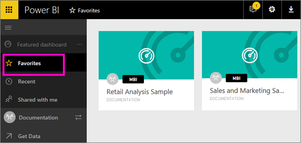

<properties
   pageTitle="Favorite dashboards in Power BI"
   description="Documentation on how to dashboards as favorites in Power BI"
   services="powerbi"
   documentationCenter=""
   authors="mihart"
   manager="mblythe"
   backup=""
   editor=""
   tags=""
   qualityFocus="no"
   qualityDate=""/>

<tags
   ms.service="powerbi"
   ms.devlang="NA"
   ms.topic="article"
   ms.tgt_pltfrm="NA"
   ms.workload="powerbi"
   ms.date="11/09/2016"
   ms.author="mihart"/>

# Favorite dashboards in Power BI

Make it easy to find your most-important dashboards. Dashboards marked as **Favorite** are accessible from all of your workspaces.

>**NOTE**: You can also select a single dashboard as a [Featured dashboard](powerbi-service-featured-dashboards.md) in Power BI.

## Add dashboards as "favorites"

1.  With the dashboard open, select **Favorite** from the top-right corner.

    

    **Favorite** changes to **Unfavorite** and the star icon becomes yellow.

    

2. To see all the dashboards that you have added as favorites, in the left navpane, select **Favorites** or select the Favorites icon .

    

    From here you can select a dashboard to open it, or share a dashboard with colleagues.

3.  Another way to mark a dashboard as a favorite is from the **Dashboards** tab.  Just [open the workspace](xxxxxxxxxxxx) that contains the dashboard, and select the star icon to the left of the dashboard name.

    

## Unfavorite a dashboard

No longer use a dashboard as much as you used to?  You can unfavorite it.

-   With the dashboard open, from the top-right corner, select **Unfavorite**.  The dashboard is removed from your Favorites but not from your workspace or Power BI.

-   Or, select **Favorites** from the left navpane, hover over the dashboard, and select the yellow star.

    

## See also

[Get Started with Power BI](powerbi-service-get-started.md)

[Power BI - Basic Concepts](powerbi-service-basic-concepts.md)

More questions? [Try the Power BI Community](http://community.powerbi.com/)
