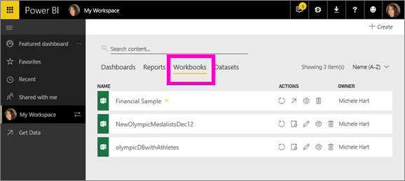

<properties
   pageTitle="Workbooks in Power BI"
   description="Workbooks in Power BI"
   services="powerbi"
   documentationCenter=""
   authors="mihart"
   manager="mblythe"
   backup=""
   editor=""
   tags=""
   qualityFocus="no"
   qualityDate=""/>

<tags
   ms.service="powerbi"
   ms.devlang="NA"
   ms.topic="article"
   ms.tgt_pltfrm="NA"
   ms.workload="powerbi"
   ms.date="11/10/2016"
   ms.author="mihart"/>

# Workbooks in Power BI

Dashboards, reports, workspaces, and datasets are at the heart of Power BI service. One type of dataset is a workbook. When you [upload a local Excel file or connect to one on OneDrive](powerbi-service-excel-workbook-files.md), Power BI adds it to the **Workbooks** tab of your workspace. You can’t edit your workbook in Power BI. But if you need to make some changes, you can open it in Excel Online (see below). Any changes you make are saved to the workbook on OneDrive.

There are samples available for you to use with Power BI. Below shows the Financial Sample. For detailed information about the sample, see [Sample datasets](powerbi-sample-datasets.md).

##  View workbooks in your workspace

You can have more than one workbook-- as you add workbooks, their titles are added to your current Power BI workspace. Only one workbook can be open at a time.

To see the list of workbooks for a given workspace, open the workspace and select the **Workbooks** tab.

From here you can do many things with your workbooks.

-  Hover over and select a workbook to open it in read-only mode. [To edit the workbook in Excel Online](powerbi-service-excel-workbook-files.md#one-excel-workbook-two-ways-to-use-it), select the pencil icon  .

-  Instantly refresh a workbook   or set up a refresh schedule .

-  Replace a workbook  .

-  [Delete a workbook ](powerbi-service-new-delete-or-remove-a-dashboard.md)  .

-  Review information about the workbook and, if you own it, you can rename it   .

-  [Add a new dataset or workbook](powerbi-service-new-create-a-dashboard.md)  

-  [Search the list of workbooks](powerbi-service-search-sort-filter.md) 

-  [Sort the list of workbooks](powerbi-service-search-sort-filter.md) 

## For more information about workbooks

From the table of contents (on the left side of this browser page), expand **Datasets** to see all the topics related to Power BI datasets.

## See also

[Power BI - Basic Concepts](powerbi-service-basic-concepts.md)

More questions? [Try the Power BI Community](http://community.powerbi.com/)
