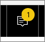
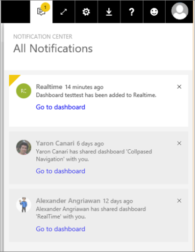

<properties
   pageTitle="Power BI Unified Notification Center"
   description="The Unified Notification Center is a sequential feed of information related to your Power BI experience."
   services="powerbi"
   documentationCenter=""
   authors="mihart"  
   manager="mblythe"
   backup=""
   editor=""
   tags=""
   qualityFocus="no"
   qualityDate=""/>

<tags
   ms.service="powerbi"
   ms.devlang="NA"
   ms.topic="article"
   ms.tgt_pltfrm="NA"
   ms.workload="powerbi"
   ms.date="06/14/2016"
   ms.author="mihart"/>

# Power BI Unified Notification Center

The Unified Notification Center is a sequential feed of information related to your Power BI experience. Open it to see messages about new dashboards that have been shared with you, changes to your Group space, information about Power BI events and meetings, and more.

1.  When you log in to Power BI, any new notifications that were sent to you while you were offline are added to your feed. If you do have new notifications, Power BI displays a yellow bubble with the number of new items.

    
 
2.  In the Power BI menubar, select the Notification icon.

    

3.  Notifications are displayed with the most-recent on top and unread messages highlighted. Notifications are retained for 90 days, unless you delete them sooner or reach the maximum limit of 100.

    

4.  To dismiss a notification, select the X icon.
