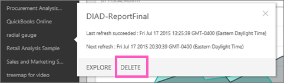

<properties 
   pageTitle="Delete an organizational content pack"
   description="Delete an organizational content pack"
   services="powerbi" 
   documentationCenter="" 
   authors="jastru" 
   manager="mblythe" 
   editor=""
   tags=""/>
 
<tags
   ms.service="powerbi"
   ms.devlang="NA"
   ms.topic="article"
   ms.tgt_pltfrm="NA"
   ms.workload="powerbi"
   ms.date="10/15/2015"
   ms.author="jastru"/>

# Delete an organizational content pack  

A coworker created a content pack and you discovered it in the content gallery and added it to your Power BI workspace. But you don't need it any longer.  How do you remove it?

To delete a content pack, you must delete the dataset.  

-   In the left Navigation pane, select the ellipses to the right of the dataset and choose **Delete \> Yes**.  
    

Deleting the dataset removes all associated reports and dashboards.  Remember, you can always return to the content gallery and add the content pack back to your workspace.

>**Note:**  
>If you create a content pack, you (and only you) can [delete it from the content pack library](https://support.powerbi.com/knowledgebase/articles/651631).

## See Also  
[Introduction to organizational content packs](https://support.powerbi.com/knowledgebase/articles/651040)  
[Get Started with Power BI](http://support.powerbi.com/knowledgebase/articles/430814-get-started-with-power-bi)  
[Power BI - Basic Concepts](http://support.powerbi.com/knowledgebase/articles/487029-power-bi-preview-basic-concepts)  
[Groups in Power BI](http://support.powerbi.com/knowledgebase/articles/654247)  