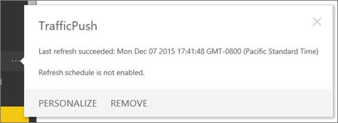

<properties 
   pageTitle="Remove your connection to an organizational content pack"
   description="Remove your connection to an organizational content pack in Power BI"
   services="powerbi" 
   documentationCenter="" 
   authors="ajayan" 
   manager="mblythe" 
   backup=""
   editor=""
   tags=""
   qualityFocus="no"
   qualityDate=""/>
 
<tags
   ms.service="powerbi"
   ms.devlang="NA"
   ms.topic="article"
   ms.tgt_pltfrm="NA"
   ms.workload="powerbi"
   ms.date="04/27/2016"
   ms.author="maggies"/>

# Remove your connection to an organizational content pack in Power BI 

A coworker created a content pack. You discovered it in the content pack library and added it to your Power BI workspace. Now you don't need it any longer.  How do you remove it?

To remove a content pack, you remove its dataset.  

-   In the left Navigation pane, select the ellipsis to the right of the dataset and select **Remove \> Yes**.  

    

Removing the dataset also removes all associated reports and dashboards.

>**Notes:**  
>
> - Removing your connection to the content pack doesn't delete the content pack from your organization's content pack library.  You can always return to the content pack library and add the content pack back to your workspace. 
> -  If you create a content pack, you (and only you) can [delete it from the content pack library](powerbi-service-organizational-content-packs-manage-update-delete.md).

### See also  
[Introduction to organizational content packs](powerbi-service-organizational-content-packs-introduction.md)  
[Get started with Power BI](powerbi-service-get-started.md)  
[Power BI - basic concepts](powerbi-service-basic-concepts.md)  
[Create a group in Power BI](powerbi-service-create-a-group-in-power-bi.md)
  