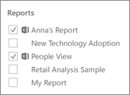
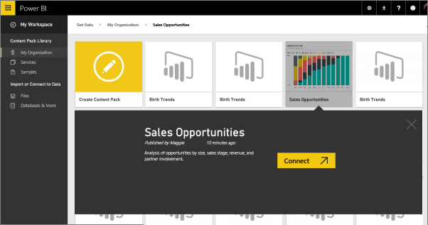

<properties 
   pageTitle="Tutorial: create and publish an organizational content pack"
   description="Tutorial: create and publish an organizational content pack in Power BI"
   services="powerbi" 
   documentationCenter="" 
   authors="maggiesMSFT" 
   manager="mblythe" 
   editor=""
   tags=""/>
 
<tags
   ms.service="powerbi"
   ms.devlang="NA"
   ms.topic="article"
   ms.tgt_pltfrm="NA"
   ms.workload="powerbi"
   ms.date="01/28/2016"
   ms.author="maggies"/>

# Tutorial: Create and publish an organizational content pack in Power BI 

In this tutorial we'll create an organizational content pack, restrict access to a specific group, and publish it to your organization's content pack library on Power BI.

>**Note:** Creating an organizational content pack requires a [Power BI Pro account](https://powerbi.microsoft.com/pricing) for you and your colleagues.

Imagine you're the Release Manager at Contoso and you're getting ready for a new product launch.  You've created a dashboard with reports that you'd like to share with the other employees managing the launch. You could [share your dashboard](powerbi-service-share-unshare-dashboard.md), but then your coworkers will have read-only permissions for the dashboard.  Instead, you want your coworkers to be able to make their own personalized version of your dashboard and reports. 

Want to follow along? Go to **[Get Data > Samples > Opportunity Analysis Sample](https://powerbi.com/groups/me/getdata/samples/opportunity-analysis-sample)** > **Connect** to get your own copy of the sample. 

1.  In the left navigation pane, select the **Opportunity Analysis Sample** dashboard.

2.  From the top navigation bar, select the cog icon  > **Create content pack**.    
    

2.  In the **Create Content Pack** window, enter the following information.  Keep in mind that a content pack library could end up with hundreds of content packs published for corporate or group use. Take time to select the right audience, to give your content pack a meaningful name, and to add a good description.  Use words that will make your content pack easy to find via search.

    a.  Select **Specific Groups** and enter the full email addresses for individuals, [Office 365 groups](powerbi-service-groups.md), distribution groups, or security groups. For example:

	salesmgrs@contoso.com; sales@contoso.com

	For this tutorial, try using your own or your group's email address.

    b.  Name the content pack **Sales Opportunities**.

	c.  Recommended: add a description. This helps coworkers more easily find the content packs that they need. Besides a description, add keywords our coworkers might use to search for this content pack. Include contact information in case your coworkers have a question or need help.

	d.  Add a logo to make it easier for group members to find the content pack &#151; it's faster to scan for an image than it is to find text. Below is a screen shot of the Opportunity Count 100% column chart tile.

	e.  Select the **Opportunity Analysis Sample** dashboard to add it to the content pack.  Power BI automatically adds the associated report and dataset. 

	>**Note:**  Only dashboards, reports, datasets, and workbooks that you can edit are listed. Thus, any that were shared with you aren't in the list.

        

	f. If you have Excel workbooks, you see them under Reports, with an Excel icon. You can add them to the content pack, too.
		
      

	>**Note**: If members of the group can't view the workbook, you may need to [share the workbook with them in OneDrive for Business](https://support.office.com/en-us/article/Share-documents-or-folders-in-Office-365-1fe37332-0f9a-4719-970e-d2578da4941c).

3.  Select **Publish** to add the content pack to the group's organizational content pack library.  

	You see a success message when it publishes successfully. 

4.  When members of your group go to **Get Data > My Organization**, they tap in the search box and type "Sales Opportunities".

	 

5.  They see your content pack.  
	 

	>**Tip:** The URL displayed in your browser is an unique address for this content pack.  Want to tell your coworkers about this new content pack?  Paste the URL into an email.

6.  They select **Connect**, and now they can [view and work with your content pack](powerbi-service-organizational-content-packs-use-and-work-with.md). 

### See also  
[Introduction to organizational content packs](powerbi-service-organizational-content-packs-introduction.md)  
[Manage, update, and delete organizational content packs](powerbi-service-organizational-content-packs-manage-update-delete.md)  
[Get Started with Power BI](powerbi-service-get-started.md)  
[Power BI - Basic Concepts](powerbi-service-basic-concepts.md)  
[Groups in Power BI](powerbi-service-groups.md)  
[What is OneDrive for Business?](https://support.office.com/en-us/article/What-is-OneDrive-for-Business-187f90af-056f-47c0-9656-cc0ddca7fdc2)