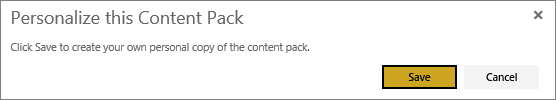

<properties 
   pageTitle="Work with organizational content packs"
   description="Work with organizational content packs in Power BI"
   services="powerbi" 
   documentationCenter="" 
   authors="ajayan" 
   manager="mblythe" 
   backup=""
   editor=""
   tags=""
   qualityFocus="no"
   qualityDate=""/>
 
<tags
   ms.service="powerbi"
   ms.devlang="NA"
   ms.topic="article"
   ms.tgt_pltfrm="NA"
   ms.workload="powerbi"
   ms.date="04/28/2016"
   ms.author="maggies"/>
# Work with organizational content packs in Power BI

When an organizational content pack is published, all recipients see the same dashboard, reports, Excel workbooks, datasets, and data (unless it's an SSAS data source).  [Only the content pack creator can edit and republish](powerbi-service-organizational-content-packs-manage-update-delete.md) the content pack.  However, all recipients can customize the dashboards and reports, and when they save their changes, a new *personalized* version of the content pack replaces the original.

## Edit an organizational content pack

Editing and saving changes to an organizational content pack creates a personalized version of the content pack, not visible to others.

1.  Open the report in the content pack and make a change. Power BI lets you know that if you save this change you'll create a personal copy of the content pack. 

     

2.  Select **Save**.  

## Help!  I can no longer access the content pack

This can happen for several reasons:

-   **Membership changes**:  Content packs are published to email distribution groups, security groups, and [Power BI groups based on Office 365](https://support.office.com/article/Create-a-group-in-Office-365-7124dc4c-1de9-40d4-b096-e8add19209e9).  If you are removed from the group, you will no longer have access to the content pack.

-   **Distribution changes**: The content pack creator changes the distribution. For example, if the content pack was originally published to the entire organization but the creator republished it to a smaller audience, you may no longer be included.

-   **Security settings changes**: If the dashboard and reports connect to on-premises SSAS data sources and changes are made to the security settings, your permissions to that server may be revoked.

## How are organizational content packs refreshed?

When the content pack is created, the refresh settings are inherited with the dataset.  When a group member creates a new personal version of the content pack, the new version retains its link to the original dataset and its refresh schedule. 

See [Manage, update, and delete organizational content packs](powerbi-service-organizational-content-packs-manage-update-delete.md).

### See also
-  [Introduction to organizational content packs](powerbi-service-organizational-content-packs-introduction.md)
-  [Get Started with Power BI](powerbi-service-get-started.md)
-  [Power BI - Basic Concepts](powerbi-service-basic-concepts.md)
-  [Create a group in Power BI](powerbi-service-create-a-group-in-power-bi.md)

