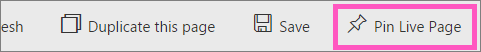
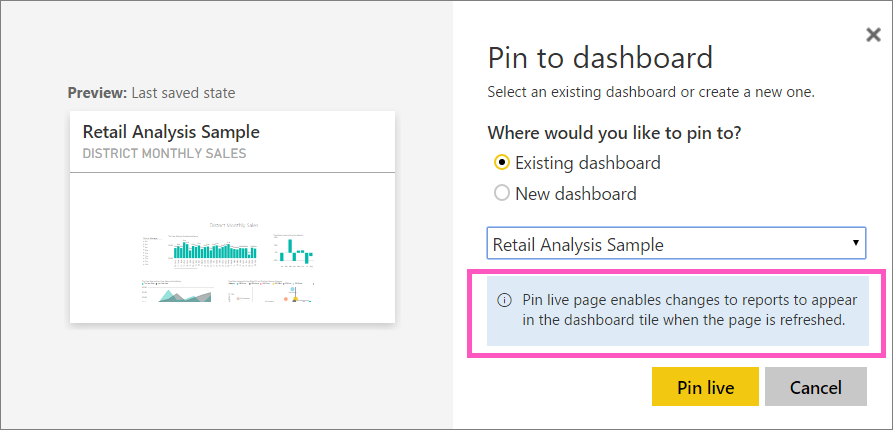

<properties
   pageTitle="Pin an entire report page to a Power BI dashboard "
   description="Pin an entire live report page to a Power BI dashboard from a report."
   services="powerbi"
   documentationCenter=""
   authors="mihart"
   manager="mblythe"
   editor=""
   tags=""/>

<tags
   ms.service="powerbi"
   ms.devlang="NA"
   ms.topic="article"
   ms.tgt_pltfrm="NA"
   ms.workload="powerbi"
   ms.date="01/28/2016"
   ms.author="mihart"/>

# Pin an entire report page, as a live tile, to a Power BI dashboard

Another way to add a new [dashboard tile](powerbi-service-dashboard-tiles.md) is by pinning an entire report page.  This is also known as pinning a *live* tile.  *Live* because you can interact with the tile on the dashboard and because, unlike individual visualization tiles, changes made in the report are synced with the dashboard. Read more about this below.

**NOTE**:  You can't pin tiles from shared reports.

## Pin a report page

Another option is to pin an entire report page to a dashboard. This is an easy way to pin more than one visualization at a time.  Also, when you pin an entire page, the tiles are *live*; you can interact with them right there on the dashboard. And changes you make to any of the visualizations back in the report editor, like adding a filter or changing the fields used in the chart, are reflected in the dashboard tile as well.  

1. From  the menubar, select **Pin Live Page**.  

2.  Pin the tile to an existing dashboard or to a new dashboard. Notice the highlighted text: *Pin live page enables changes to reports to appear in the dashboard tile when the page is refreshed.*

-   Existing dashboard: select the name of the dashboard from the dropdown. Dashboards that have been shared with you will not appear in the dropdown.

-   New dashboard: type the name of the new dashboard.

     

3.  Select **Pin live**. A Success message (near the top right corner) lets you know the visualization was added, as a tile, to your dashboard.

4.  From the navigation pane, select the dashboard with the new live tile. There, you can [rename, resize, link, and move](powerbi-service-edit-a-tile-in-a-dashboard.md) the pinned report page.  

5. Interact with the live tile.  In the screenshot below, selecting a bar on the column chart has cross-filtered and cross-highlighted the other visualizations on the tile.

    

## See also

[Reports in Power BI](powerbi-service-reports.md)

[Q&A in Power BI](powerbi-service-q-and-a.md)

[Power BI Preview - Basic Concepts](powerbi-service-basic-concepts.md)

[Dashboards in Power BI](powerbi-service-dashboards.md)
