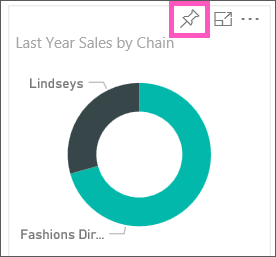
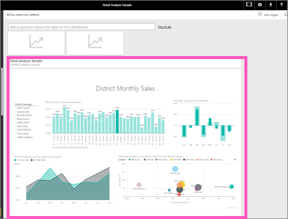

<properties
   pageTitle="Pin a tile to a Power BI dashboard from a report"
   description="Pin a tile to a Power BI dashboard from a report."
   services="powerbi"
   documentationCenter=""
   authors="mihart"
   manager="mblythe"
   editor=""
   tags=""/>

<tags
   ms.service="powerbi"
   ms.devlang="NA"
   ms.topic="article"
   ms.tgt_pltfrm="NA"
   ms.workload="powerbi"
   ms.date="01/26/2016"
   ms.author="mihart"/>

# Pin a tile to a Power BI dashboard from a report
## Pinning tiles from a report

One way to add a new [dashboard tile](powerbi-service-dashboard-tiles.md) is from within a [Power BI report](powerbi-service-reports.md). In fact, you can add many new tiles from a report.  Each of these tiles, when clicked, is a link back into the report.

And entire report pages can be pinned to a dashboard.  This is also known as pinning a *live* tile.  *Live* because you can interact with the tile on the dashboard and because, unlike individual visualization tiles, changes made in the report are synced with the dashboard. Read more about this below.

**NOTE**:  You can't pin tiles from shared reports.

## Pin a tile from a report in Reading View or Editing View

When you open a report that has one or more pages, it [opens in Reading View](powerbi-service-open-a-report-in-reading-view.md): you can interact with the visualizations and filters, but not edit the report. You can pin a tile from Reading View or from Editing View.

1.  Hover over the visualization you want to pin, and select the pin  icon. 

    

2.  Pin the tile to an existing dashboard or to a new dashboard. 

    -   Existing dashboard: select the name of the dashboard from the dropdown. Dashboards that have been shared with you will not appear in the dropdown.

    -   New dashboard: type the name of the new dashboard.

3.  Select **Pin**.

    A Success message (near the top right corner) lets you know the visualization was added, as a tile, to your dashboard.

    

4.  From the navigation pane, select the dashboard with the new tile. There, you can [rename, resize, link, and move](powerbi-service-edit-a-tile-in-a-dashboard.md) the pinned visualization.

## Pin an entire report page

Another option is to pin an entire report page to a dashboard. This is an easy way to pin more than one visualization at a time.  Also, when you pin an entire page, the tiles are *live*; you can interact with them right there on the dashboard. And changes you make to any of the visualizations back in the report editor, like adding a filter or changing the fields used in the chart, are reflected in the dashboard tile as well.  

1. From  the menubar, select **Pin Live Page**.  

2.  Pin the tile to an existing dashboard or to a new dashboard as described above. Notice the highlighted text: *Pin live page enables changes to reports to appear in the dashboard tile when the page is refreshed.*

     

3.  Select **Pin live**. A Success message (near the top right corner) lets you know the visualization was added, as a tile, to your dashboard.

4.  From the navigation pane, select the dashboard with the new live tile. There, you can [rename, resize, link, and move](powerbi-service-edit-a-tile-in-a-dashboard.md) the pinned report page.  

5. Interact with the live tile.  In the screenshot below, selecting a bar on the column chart has cross-filtered and cross-highlighted the other visualizations on the tile.

    

## See also

[Reports in Power BI](powerbi-service-reports.md)

[Q&A in Power BI](powerbi-service-q-and-a.md)

[Power BI Preview - Basic Concepts](powerbi-service-basic-concepts.md)

[Dashboards in Power BI](powerbi-service-dashboards.md)
