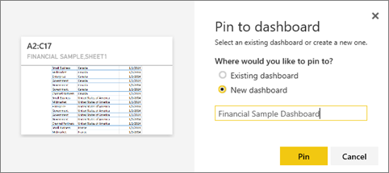
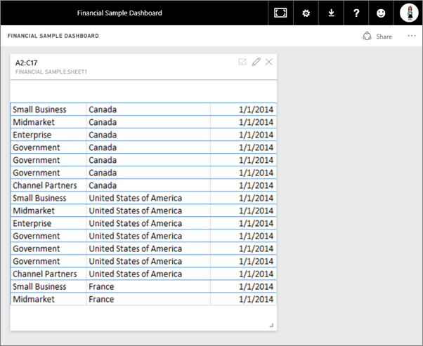

<properties
   pageTitle="Pin a tile to a Power BI dashboard from Excel"
   description="Pin a tile to a Power BI dashboard from Excel. Pin ranges, charts, tables."
   services="powerbi"
   documentationCenter=""
   authors="mihart"
   manager="mblythe"
   editor=""
   tags=""/>

<tags
   ms.service="powerbi"
   ms.devlang="NA"
   ms.topic="article"
   ms.tgt_pltfrm="NA"
   ms.workload="powerbi"
   ms.date="11/14/2015"
   ms.author="mihart"/>

# Pin a tile to a Power BI dashboard from Excel

## Pin ranges, cells, pivot tables, and charts from Excel

One way to add a new [dashboard tile](powerbi-service-dashboard-tiles.md) is from within an Excel workbook. Ranges, charts, and tables can be pinned from Excel workbooks that have been saved in your OneDrive for Business or another group-shared document library.  

>**NOTE**:  You can't pin tiles from workbooks that have been shared with you.

## Connect your Excel workbook to Power BI

1.  Upload your workbook to your Power BI for Business site.

2. From Power BI, [connect to that workbook](powerbi-bring-in-whole-excel-files.md).

2.  In Power BI, the workbook is listed in the left navigation pane under **Reports**. The  icon indicates this is an Excel workbook and the yellow asterisk indicates it's new.

  

  Open the workbook in Power BI by selecting the ellipses and choosing either **View** or **Edit**.

>**NOTE:**  Changes you make to the workbook in Power BI are not saved and do not affect the original workbook on your OneDrive for Business site. To update the workbook, select the ellipses and choose **Edit**.  This opens the workbook in Excel Online.

## Pin a range to a dashboard

1. Highlight the cells that you'd like to pin to a dashboard.

  

2.  Select the pin  icon. 

2.  Pin the tile to an existing dashboard or to a new dashboard. 

    -   Existing dashboard: select the name of the dashboard from the dropdown.

    -   New dashboard: type the name of the new dashboard.

  

3.  Select **Pin**.

    A Success message (near the top right corner) lets you know the range was added, as a tile, to your dashboard.

    

4.  From the navigation pane, select the dashboard with the new tile. There, you can [rename, resize, link, and move](powerbi-service-edit-a-tile-in-a-dashboard.md) the pinned visualization.

## Pin an entire table or pivot chart to a dashboard

1.  To pin a table or pivot table, select the entire range of the table.

  - For tables, make sure to include the headers.

  - For pivot tables, make sure to include every visible part of the pivot table, including filters if used.

    

2. Follow steps 2-4 above.

>**NOTE**: A tile created from a table or pivot table will show the entire table.  If you add/remove/filter rows or columns in the original workbook, they will also be added/removed/filtered in the tile.

## See also

[Reports in Power BI](powerbi-service-reports.md)

[Power BI Preview - Basic Concepts](powerbi-service-basic-concepts.md)

[Dashboards in Power BI Preview](powerbi-service-dashboards.md)
