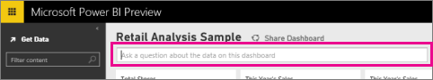
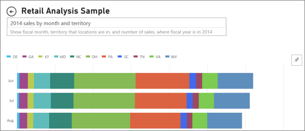

<properties 
   pageTitle="Pin a tile to a Power BI dashboard from the Q&A question box"
   description="Pin a tile to a Power BI dashboard from the Q&A question box"
   services="powerbi" 
   documentationCenter="" 
   authors="jastru" 
   manager="mblythe" 
   editor=""
   tags=""/>
 
<tags
   ms.service="powerbi"
   ms.devlang="NA"
   ms.topic="article"
   ms.tgt_pltfrm="NA"
   ms.workload="powerbi"
   ms.date="10/15/2015"
   ms.author="jastru"/>

# Pin a tile to a Power BI dashboard from the Q&A question box  

Q&A is the Power BI ad hoc reporting tool. Need to find a particular insight? Ask a question about your data, and receive an answer in the form of a visualization.

1.  Create a [dashboard](http://support.powerbi.com/knowledgebase/articles/424868) and [get data](http://support.powerbi.com/knowledgebase/articles/434354).

2.  In the question box at the top of your dashboard, start typing what you want to know about your data.  
    

3.  For example, as you type "last year sales by month and territory"...  
    

    the question box restates your question as "Show month, territory that stores are in, and last year sales..."

4.  To add the chart to your dashboard as a tile, select the pin  on the right side of the question box. 

5.  Pin the tile to an existing dashboard or to a new dashboard. 

    -   Existing dashboard: select the name of the dashboard from the dropdown.

    -   New dashboard: type the name of the new dashboard.

6.  Select Pin.

    A Success message (near the top right corner) lets you know the visualization was added, as a tile, to your dashboard.  
    

7.  From the navigation pane, select the dashboard with the new tile. There, you can [rename, resize, add a hyperlink, and reposition the tile](http://support.powerbi.com/knowledgebase/articles/424878) on your dashboard. 

## Tips for using Q&A  
-   When you start typing a question, Q&A immediately begins searching for the best answer from all datasets associated with the current dashboard.  The "current dashboard" is the dashboard highlighted in the navigation pane.

-   **How does Q&A know which datasets to use**?  Q&A has access to all datasets that have visualizations pinned to that dashboard.

## See Also  
[Dashboards in Power BI](http://support.powerbi.com/knowledgebase/articles/424868)  
[Q&A in Power BI](http://support.powerbi.com/knowledgebase/articles/474566)  
[Power BI - Basic Concepts](http://support.powerbi.com/knowledgebase/articles/487029)  