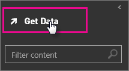
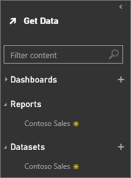

<properties pageTitle="Power BI Designer files" description="Power BI Designer files" services="powerbi" documentationCenter="" authors="v-anpasi" manager="mblythe" editor=""/>
<tags ms.service="powerbi" ms.devlang="NA" ms.topic="article" ms.tgt_pltfrm="NA" ms.workload="powerbi" ms.date="06/26/2015" ms.author="v-anpasi"/>
#Power BI Designer files
[← Files in Power BI](https://support.powerbi.com/knowledgebase/topics/88767-files-in-power-bi)

You can get data and reports from your Power BI Designer files. When you upload your Power BI Designer files to Power BI, the data gets uploaded to the cloud as well.

 **Important:** Currently, Power BI Designer files uploaded to Power BI cannot be refreshed.

 **Important:** In Power BI, the maximum size of a Power BI Designer file you can upload to your Power BI site is 250 megabytes.

##To get a Power BI Designer file

1.  In Power BI, click **Get Data**.

2.  In **Get data**, click **Power BI Designer File** > **Connect**.

3.  Browse to your report file, then click **Connect**. Power BI Designer files have a **.pbix** extension.

After you upload the Designer file to your Power BI page, the Designer file report appears under **Reports** in the navigation pane and the dataset appears under **Datasets**. You can edit your report and pin visualizations to your dashboard right in Power BI.

**Tip**: Any changes you make in Power BI, for example, add, delete, or change visualizations in reports, aren't saved in the original Power BI Designer file. Changes to a Power BI Designer file can only be made in the Designer.

##See also 
[Get started with Power BI Designer](http://support.powerbi.com/knowledgebase/articles/471664-getting-started-with-power-bi-designer)   
[Get Started with Power BI](http://support.powerbi.com/knowledgebase/articles/430814-get-started-with-power-bi-preview)  
[Get Data](http://support.powerbi.com/knowledgebase/topics/63369-get-data)