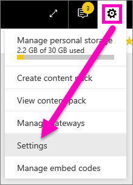

<properties
   pageTitle="Opt-in for preview features"
   description="How to turn on (and off) Power BI features that are in Preview."
   services="powerbi"
   documentationCenter=""
   authors="mihart"
   manager="mblythe"
   backup=""
   editor=""
   tags=""
   featuredVideoId=""
   qualityFocus=""
   qualityDate=""/>

<tags
   ms.service="powerbi"
   ms.devlang="NA"
   ms.topic="article"
   ms.tgt_pltfrm="NA"
   ms.workload="powerbi"
   ms.date="11/09/2016"
   ms.author="mihart"/>

# Opt-in for Power BI preview features
## What are *preview features*?

As we make improvements to Power BI, we'll release some new functionality as *preview features*. Preview features can be turned on and off, giving you the opportunity to try them out.

>[AZURE.IMPORTANT] At the current time, [the only preview feature available is the **new navigation**](powerbi-service-new-switch-navigation-experience.md).

##    Current previews available
**Navigation preview**: Starting in November 2016, we're previewing a [new Power BI navigation experience](powerbi-service-new-switch-navigation-experience.md). You'll be able to try it out for yourself, switching back and forth between the two experiences.

##  Turn a preview feature on (and off)

1.  Open your Settings menu by selecting the gear icon in the top right corner of your Power BI screen and choosing **Settings**.

    .

2.  Select the **General** tab and choose **Preview features**.

   

3.  Select the **On** radio button to try out the new experience. Click **Apply**.

4. To turn preview features off, follow steps 1-2 above, and in step 3, select **Off** > **Apply**.

## See also
[New Power BI navigation experience](powerbi-service-new-switch-navigation-experience.md)

More questions? [Try the Power BI Community](http://community.powerbi.com/)
