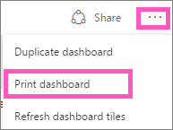
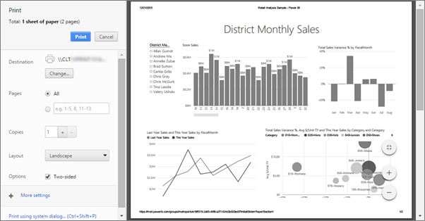

<properties
   pageTitle="Print a dashboard, print a report"
   description="Printing a dashboard or report from Power BI."
   services="powerbi"
   documentationCenter=""
   authors="mihart"
   manager="mblythe"
   editor=""
   tags=""/>

<tags
   ms.service="powerbi"
   ms.devlang="NA"
   ms.topic="article"
   ms.tgt_pltfrm="NA"
   ms.workload="powerbi"
   ms.date="02/23/2016"
   ms.author="mihart"/>

# Printing from Power BI

Print an entire dashboard or a report page from Power BI.  

>**NOTE**:  Printing to PDF is one of the supported print options in Edge and Chrome or other browsers if you've already configured the PDF driver.   

## Print a dashboard

1. Open the dashboard you'd like to print.

2. In the top right corner, select the ellipses (...) and choose **Print dashboard**.

    

3. Choose the settings and print destination, and select **Print**.

    

  > **NOTE**: The print dialog you see will depend on which browser you are using.

## Print a report page

1. Open the report in either Reading View or Editing View.

2. Select **File** > **Print page** to print the current report page.

    

2. Choose the settings and print destination, and select **Print**.

    

  > **NOTE**: The print dialog you see will depend on which browser you are using.

## See also

[Dashboards in Power BI](powerbi-service-dashboards.md)

[Power BI - Basic Concepts](powerbi-service-basic-concepts.md)
