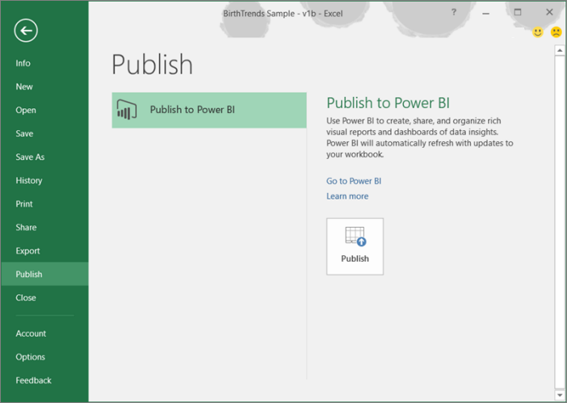
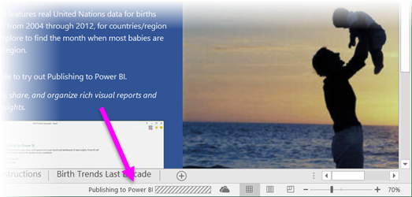
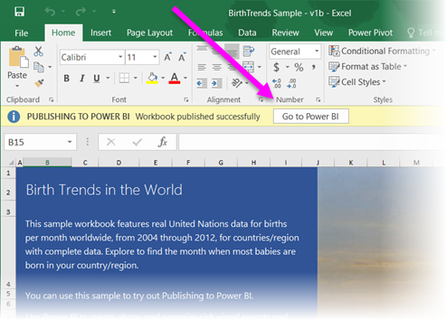
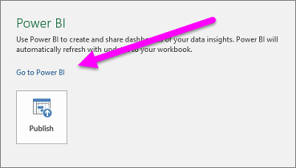

<properties
   pageTitle="Publish to Power BI from Excel"
   description="Learn how to publish an Excel workbook to your Power BI site."
   services="powerbi"
   documentationCenter=""
   authors="Minewiskan"
   manager="mblythe"
   editor=""
   tags=""/>

<tags
   ms.service="powerbi"
   ms.devlang="NA"
   ms.topic="article"
   ms.tgt_pltfrm="NA"
   ms.workload="powerbi"
   ms.date="11/06/2015"
   ms.author="owend"/>

# Publish to Power BI from Excel  
In Excel 2016, you can publish your workbooks on OneDrive for Business right to your Power BI site. When you publish to Power BI, you can leverage your exiting Power View reports or create new reports and dashboards based on your workbook data. You can then share your reports and dashboards with others in your organization.

To publish your Excel workbook to Power BI, **select File** > **Publish**.

Excel displays the progress of publishing to Power BI.

When complete, you can go to your report in Power BI right from Excel.

You can also go to Power BI from the **File** > **Publish screen**.

When your workbook is published to your Power BI site, any Power View reports you already had will appear in Reports, and a new dataset appears in Datasets.

You can continue working in your workbook. When you save, your changes automatically appear in Power BI, usually in about an hour.

### Limitations
There are a few limitations when publishing from Excel to Power BI:

-  Publishing to Power BI requires your workbook to be saved on OneDrive for Business. If your workbook isn't saved to a OneDrive for Business account, publishing to Power BI will guide you through the process of uploading to OneDrive for Business, then publishing to Power BI.
-  Your OneDrive for Business account must be associated with the account with which you’re using Excel.
-  You can’t publish an empty workbook, nor a workbook that doesn’t have any Power BI supported content. Get more information about [supported content](powerbi-service-excel-data.md).
-  You can’t publish encrypted workbooks, which are workbooks that are password protected, have Information Protection Management, or IRM.
-  Publishing to Power BI requires modern authentication to be enabled (it is enabled by default). If modern authentication is disabled, the Publish option is not available from the File menu. Contact your administrator to [enable modern authentication](https://support.office.com/en-us/article/Enable-Modern-Authentication-for-Office-2013-on-Windows-devices-7dc1c01a-090f-4971-9677-f1b192d6c910?ui=en-US&rs=en-US&ad=US).
