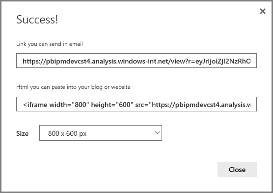
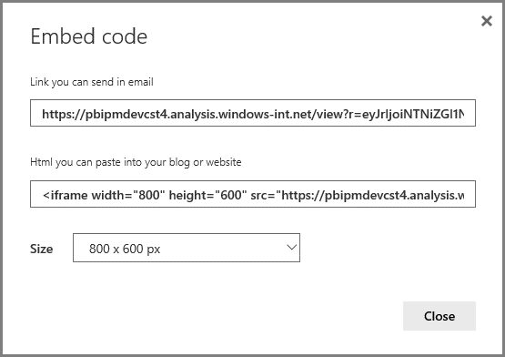
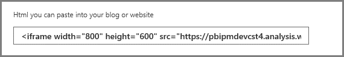
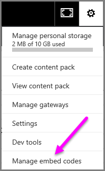

<properties
   pageTitle="Publish from Power BI to the web (preview)"
   description="Publish from Power BI to the web (preview)"
   services="powerbi"
   documentationCenter=""
   authors="davidiseminger"
   manager="mblythe"
   editor=""
   tags=""/>

<tags
   ms.service="powerbi"
   ms.devlang="NA"
   ms.topic="article"
   ms.tgt_pltfrm="NA"
   ms.workload="powerbi"
   ms.date="02/02/2016"
   ms.author="davidi"/>
# Publish from Power BI to the web

With Power BI **Publish to web** you can easily embed interactive Power BI visualizations online,such as in blog posts, websites, through emails or social media, and all sorts of other online communications, on any device. You can also easily edit, update, refresh or un-share your published visuals.

> **Warning:** When you use **Publish to web**, the report or visual you publish can be viewed by anyone on the Internet. There is no authentication used when viewing these reports. Only use Publish to web with reports and data that the anyone on the Internet (unauthenticated members of the public) should be able to see. Do not use Publish to web with sensitive data, data that has financial implications, data that must remain confidential, or data that you do not have the license rights to publish.

## How to use Publish to Web

**Publish to web** is available on reports in your personal workspace that you can edit.  You cannot use Publish to web with reports that were shared with you. Please review the **Warning** earlier in this article before using Publish to web.

You can watch how this feature works in the following *short video*. Then, follow the steps below to try it yourself.

<iframe width="560" height="315" src="https://www.youtube.com/embed/UF9QtqE7s4Y" frameborder="0" allowfullscreen></iframe>

The following steps describe how to use **Publish to web**.

1.  On a report in your workspace that you can edit, select **File  > Publish to web**.

    

2.  Review the content on the dialog, and select **Create embed code** as shown in the following dialog.

    

3.  Review the warning, shown in the following dialog, and confirm that the data is okay to embed in a public website. If so, select **Publish**.

    

4.  A dialog appears that provides a link that can be sent in email, embedded in code (such as an iFrame), or that you can paste directly into your web page or blog.

    

5.  If you’ve previously created an embed code for the report, the embed code quickly appears. You can only create one embed code for each report.

    

## Tips and Tricks for View modes

When you embed content within a blog post, you typically need to fit it within a specific size of the screen.  You can also adjust the height and the width in the iFrame tag as needed, but you may also need to ensure your report fits within the given area of the iFrame, so you also need to set an appropriate View Mode when editing the report.

The following table provides guidance about the View Mode, and how it will appear when embedded.

|View Mode|How it looks when embedded|
|---|---|
||**Dynamic** is the recommended View Mode for reports that need to fit within a specific size of the page. The content will scale to fit the exact dimensions of your iFrame.  Using Dynamic avoids scrollbars from appearing in your iFrame. You can adjust the exact height and width by setting the height and width in your iFrame tag. |
|| **Fit to page** will respect the page height and width of your report.  When embedded in an iFrame, using **Fit to page** results in a border surrounding the content. This can be desirable when you’d like your embedded report to maintain its aspect ratio when embedded. A border is shown surrounding your report in **Fit to page** mode.|
|| **Fit to width** ensures the content fits within the horizontal area for your iFrame. A border will still be shown, but the content will scale to use all the horizontal space available.  |
|| **Actual size** will ensure the report preserves its size as set on the report page.  This can result in scrollbars being present in your iFrame.|

## Tips and tricks for working with the embed code

The embed code you receive after you Publish to web will look like the following:

You can edit the width and height manually to ensure it is precisely how you want it to fit onto the page into which you're embedding it.

## Managing embed codes

Once you create a **Publish to web** embed code, you can manage the codes you create from the **Settings** menu of the Power BI service. Managing embed codes includes the ability to remove the destination visual or report for a code (rendering the embed code unusable), or getting the embed code again.

1.  To manage your **Publish to web* embed codes, open the **Settings** gear and select **Manage embed codes**.

    

2.  The list of embed codes you’ve created appears, as shown in the following image.

    

3.  For each **Publish to web** embed code in the list, you can either retrieve the embed code, or delete the embed code and thus make any links to that report or visual no longer work.

    > **Note:** Deleting an embed code takes approximately 1 hour to process and complete.

    

4.  If you select **Delete**, you’re asked if you’re sure you want to  delete the embed code.

    

    > **Note:** Deleted embed codes are immediately removed from the list, but the link can remain active for approximately 1 hour after the delete action is removed from the list.   

## Updates to reports, and data refresh

After you create your **Publish to web** embed code and share it, the report is updated with any changes you make. However, it’s important to know that it can take a while for update to be visible to your users. Updates to a report or visual take approximately one hour to be reflected in Publish to web embed codes.

When you initially use **Publish to web** to get an embed code, the embed code link is immediately active and can be viewed by anyone who opens the link.  After the initial Publish to web action, subsequent updates to reports or visuals to which a Publish to web link points can take approximately one hour to be visible to your users.

To learn more, see the **How it works** section later in this article.  If you need your updates to be immediately available, you can use the **Save as...** feature to save a copy of the report with updated information, and then you can create a new Publish to web embed code for the new report.

## Data refresh

Data refreshes are reflected in your embedded report or visual. It can take approximately 1 hour for refreshed data to be visible from embed codes. You can disable automatic refresh by selecting **do not refresh** on the schedule for the dataset used by the report.  

## Custom visuals

Custom visuals are supported in **Publish to web**. When you use Publish to web, users with whom you share your published visual do not need to enable custom visuals to view the report.

## Limitations

**Publish to web** is supported for the vast majority of data sources and reports in the Power BI service, however, the following are not currently supported or available with Publish to web:

1.  Reports for groups

2.  Reports that use Direct Query data sources

3.  Reports using real-time data sources.

## Understanding the embed code status column

When viewing the **Manage embed codes** page for your **Publish to web** embed codes, a status column is provided. Embed codes are active by default, which means the report is available for Internet users to view and interact with. However, if the content of the report violates the [Power BI Terms of Service](https://powerbi.microsoft.com/terms-of-service), that report or visual may be blocked. In this case, the embed code status will say *blocked*.  

## How to report a concern with Publish to web content

To report a concern related to **Publish to web** content embedded in a website or blog, use the **Flag** icon in the bottom bar, shown in the following image. You’ll be asked to send an email to Microsoft explaining the concern. Microsoft will evaluate the content based on the Power BI Terms of Service, and take appropriate action.

To report a concern, select the **flag** icon in the bottom bar of the Publish to web report you see.

## Licensing and Pricing

You need to be a Microsoft Power BI user to use **Publish to web**. Power BI users can use Publish to web during preview at no additional cost.

## How it works (technical details)

When you create an embed code using **Publish to web**, the report is made visible to users on the Internet. It’s publicly available and may be featured in a public gallery (no gallery is in place during our preview). As users view the report, either by opening the direct public URL or viewing it embedded in a web page or blog, Power BI caches the report definition and the results of the queries required to view the report. This approach ensures the report can be viewed by thousands of concurrent users without any impact on performance.  

The cache is long-lived, so if you update the report definition (for example, if you change its View mode) or refresh the report data, it can take approximately one hour before changes are reflected in the version of the report viewed by your users. It is therefore recommended that you stage your work ahead of time, and create the **Publish to web** embed code only when you’re satisfied with the settings.
