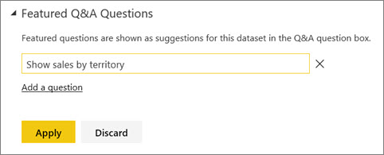
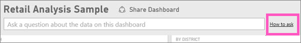
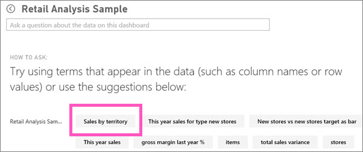

<properties
   pageTitle="Create featured questions for Power BI Q&A"
   description="Documentation on how to create featured questions for Power BI Q&A"
   services="powerbi"
   documentationCenter=""
   authors="mihart"
   manager="mblythe"
   backup=""
   editor=""
   tags=""
   qualityFocus="no"
   qualityDate=""/>

<tags
   ms.service="powerbi"
   ms.devlang="NA"
   ms.topic="article"
   ms.tgt_pltfrm="NA"
   ms.workload="powerbi"
   ms.date="05/11/2016"
   ms.author="mihart"/>

# Create featured questions for Power BI Q&A  

If you own a dataset, you can add your own featured questions to that dataset.  And Power BI Q&A will show those questions to colleagues who use your dataset.  Featured questions give your colleagues ideas about the types of questions they can ask about the dataset. The featured questions you add are up to you -- add popular questions, questions that display interesting results, or questions that may be hard to phrase.

Watch Will add some Featured Questions to Power BI Q&A and then use those Featured Questions to explore his dataset. Then follow the step-by-step instructions below the video to try it out yourself.
<iframe width="560" height="315" src="https://www.youtube.com/embed/r6_i3O0km8o" frameborder="0" allowfullscreen></iframe>

This article uses the [Retail Analysis Sales sample](powerbi-sample-datasets.md).

1.  Select the Q&A question box.   Notice that Q&A is already being helpful by displaying a list of terms that appear in the dataset.

2.  To add to this list, select the gear icon in the top right corner of Power BI.  
    

3.  Select **Settings** &gt; **Datasets** &gt; **Retail Analysis sample** &gt; **Featured Q&A Questions**.  

4.  Select **Add a question**.

    

5.  Type your question in the text box and select **Apply**.   Optionally, add another question by selecting **Add a question**.  
    
6.  Navigate back to the Power BI dashboard for Retail Analysis Sample, and select the **How to ask** link.  
    

7.  The new featured question, **Sales by territory**, is first in the list. Select it.  
    
8.  The answer displays as a map visualization.  
    

## See Also
[Q&A in Power BI](powerbi-service-q-and-a.md)  
[Tutorial: Introduction to Power BI Q&A](powerbi-service-tutorial-introduction-to-q-and-a.md)  
[Power BI - Basic Concepts](powerbi-service-basic-concepts.md)  
