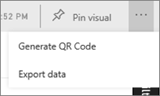
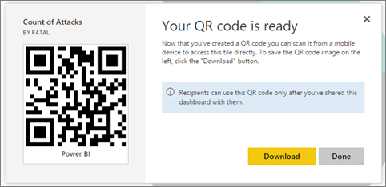

<properties
   pageTitle="Create a QR code for a tile"
   description="Create a QR code for a tile in Power BI"
   services="powerbi"
   documentationCenter=""
   authors="maggies"
   manager="mblythe"
   editor=""
   tags=""/>

<tags
   ms.service="powerbi"
   ms.devlang="NA"
   ms.topic="article"
   ms.tgt_pltfrm="NA"
   ms.workload="powerbi"
   ms.date="01/29/2016"
   ms.author="maggies"/>

# Create a QR code for a tile in Power BI

QR codes in Power BI can connect anything in the real world directly to related BI information &#151; no navigation or search needed.

You can create a QR code in the Power BI service for tiles in any dashboard that you can edit. Then place the QR code in a key location. For example, you could paste it in an email, or print it out and paste it in a specific location. 

Colleagues you've shared the dashboard with can scan the QR code for access to the relevant tile, right from [their iPhone](powerbi-mobile-qr-code-for-tile.md) or from [their Android phone](powerbi-mobile-qr-code-for-android.md). They can use either the QR code scanner located in the Power BI app, or any other QR scanner installed on their phone. Read more about [how to share dashboards](powerbi-service-how-should-i-share-my-dashboard.md).

## Add a QR code to a tile in the Power BI service

1. Open a dashboard in the Power BI service.

2. Select the ellipsis (...) in the top-right corner of the tile and select **Focus mode** .

2. Select the ellipsis (...) in the top-right corner and select **Generate QR code**. 

    

3. A dialog box with the QR code appears. 

    

4. From here you can scan the QR code or download and save it so you can: 

     - Add it to an email or other document, or 
     - Print it and place it in a specific location. 

## Print the QR code

Power BI generates the QR code as a PNG file, ready to print. 

1. Right-click the QR code image, and save the image to a convenient location. 

2. Download or open the PNG file on a computer connected to a printer.  

2. Print the file at 100% or “actual size”.  

3. Cut out the QR code along its gray frame and glue it to a place relevant to the tile. 

### See also

[Scan a Power BI QR code from your iPhone](powerbi-mobile-qr-code-for-tile.md)

[Scan a Power BI QR code from your Android phone](powerbi-mobile-qr-code-for-android.md)

[Dashboard tiles in Power BI](powerbi-service-dashboard-tiles.md)

[Power BI - Basic Concepts](powerbi-service-basic-concepts.md)
