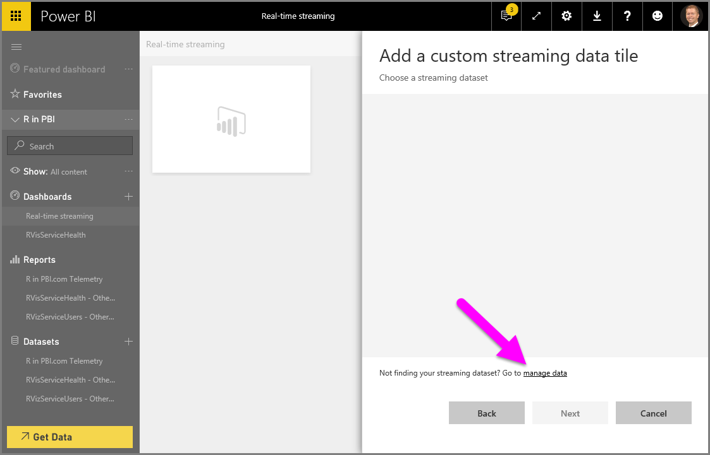
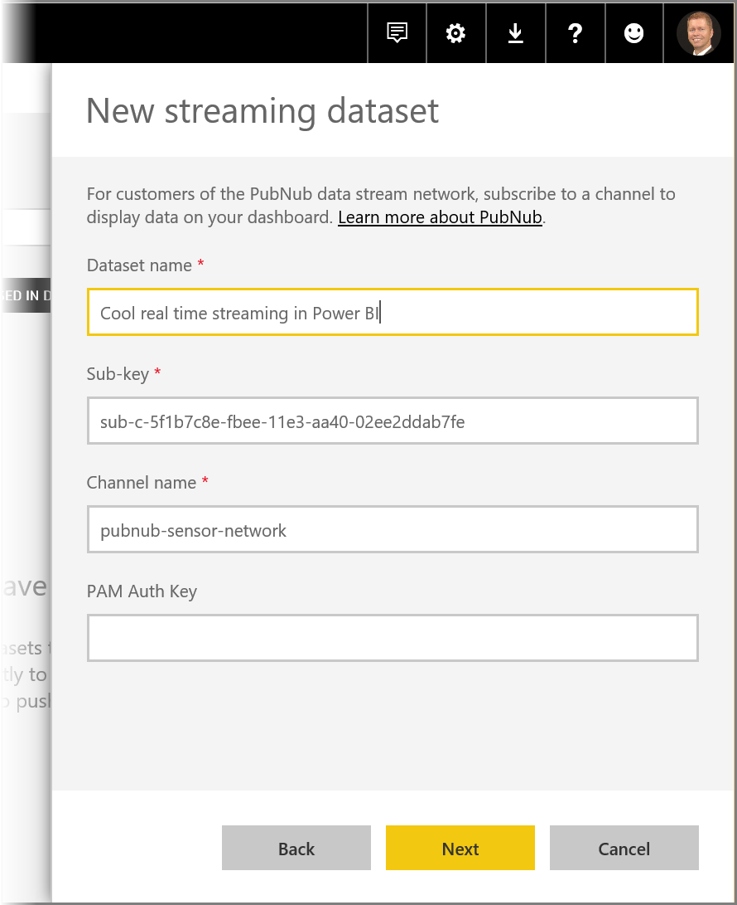

<properties
   pageTitle="Real-time streaming in Power BI"
   description="Get real-time data streaming and visuals in Power BI"
   services="powerbi"
   documentationCenter=""
   authors="davidiseminger"
   manager="mblythe"
   backup=""
   editor=""
   tags=""
   qualityFocus="no"
   qualityDate=""/>

<tags
   ms.service="powerbi"
   ms.devlang="NA"
   ms.topic="article"
   ms.tgt_pltfrm="NA"
   ms.workload="powerbi"
   ms.date="01/31/2017"
   ms.author="davidi"/>

# Real-time streaming in Power BI

With Power BI real-time streaming, you can stream data and update dashboards in real-time. Any visual or dashboard that can be created in Power BI can also be created to display and update real-time data and visuals. The devices and sources of streaming data can be factory sensors, social media sources, service usage metrics, and anything else from which time-sensitive data can be collected or transmitted.

## Set up your real-time streaming dataset in Power BI

To get started with real-time streaming, you need to choose one of the two ways that streaming data can be consumed in Power BI:

-   **tiles** with visuals from streaming data
-   **datasets** created from streaming data that persist in Power BI

With either option, you'll need to set up **Streaming data** in Power BI. To do this, in your dashboard (either an existing dashboard, or a new one) select **Add a tile** and then select **Custom streaming data**.

If you don't have streaming data set up yet, don't worry - you can select **manage data** to get started.

On this page, you can input the endpoint of your streaming dataset if you already have one created (into the text box). If you don't have a streaming dataset yet, select the plus icon ( **+** ) in the upper right corner to see the available options to create a streaming dataset.

When you click on the **+** icon, you see two options:

The next section describes these options, and goes into more detail about how to create a streaming **tile** or how to create a **dataset** from the streaming data source, which you can then use later to build reports.

## Create your streaming dataset with the option you like best

There are two ways to create a real-time streaming data feed that can be consumed and visualized by Power BI:

-   **Power BI REST API** using a real-time streaming endpoint
-   **PubNub**

The next sections look at each option in turn.

### Using the POWER BI REST API

**Power BI REST API** - Recent improvements to the Power BI REST API are designed to make real-time streaming easier for developers. When you select **API** from the **New streaming dataset** window, you're presented with entries to provide that enable Power BI to connect to and use your endpoint:

If you want Power BI to store the data that's sent through this data stream, enable *Historic data analysis* and you'll be able to do reporting and analysis on the collected data stream. You can also [learn more about the API](https://msdn.microsoft.com/library/dn877544.aspx).

Once you successfully create your data stream, you're provided with a REST API URL endpoint, which you application can call using *POST* requests to push your data to Power BI **streaming data** dataset you created.

### Using PubNub

With the integration of **PubNub** streaming with Power BI, you can use your low-latency **PubNub** data streams (or create new ones) and use them in Power BI. When you select **PubNub** and then select **Next**, you see the following window:

**PubNub** data streams are often high volume, and are not always suitable in their original form for storage and historical analysis. To use Power BI for historical analysis of PubNub data, you'll have to aggregate the raw PubNub stream and send it to Power BI. One way to do that is with [Azure Stream Analytics](https://azure.microsoft.com/services/stream-analytics/).

## Example of using real time streaming in Power BI

Here's a quick example of how real time streaming in Power BI works. You can follow along with this sample to see for yourself the value of real time streaming.

In this sample, we use a publicly available stream from **PubNub**. Here are the steps:

1.  In the **Power BI service**, select a dashboard (or create a new one) and select **Add tile** > **Custom Streaming Data** and then select the **Next** button.

    

2.  If you don't have and streaming data sources yet, select the **manage data** link (just above the **Next** button), then select **+ Add streaming data** from the link in the upper-right of the window. Select **PubNub** and then select **Next**.

3.  Create a name for your dataset, then paste in the following values into the window that appears, then select **Next**:

    *Subscribe key:*
        sub-c-5f1b7c8e-fbee-11e3-aa40-02ee2ddab7fe
    *Channel:*
        pubnub-sensor-network

    

4.  In the following window, just select the defaults (which are automatically populated), then select **Create**.

    

5.  Back in your Power BI workspace, create a new dashboard and then add a tile (see above for steps, if you need them). This time when you create a tile and select **Custom Streaming Data**, you have a streaming data set to work with. Go ahead and play around with it. Adding the *number* fields to line charts, and then adding other tiles, you can get a real time dashboard that looks like the following:

    

Give it a try, and play around with the sample dataset. Then go create your own datasets, and stream live data to Power BI.
