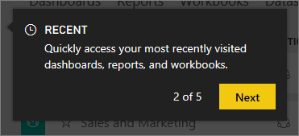

<properties
   pageTitle="Display recently-visited content in Power BI"
   description="documentation for recents in Power BI"
   services="powerbi"
   documentationCenter=""
   authors="mihart"
   manager="erikre"
   backup=""
   editor=""
   tags=""
   qualityFocus="no"
   qualityDate=""/>

<tags
   ms.service="powerbi"
   ms.devlang="NA"
   ms.topic="article"
   ms.tgt_pltfrm="NA"
   ms.workload="powerbi"
   ms.date="04/18/2017"
   ms.author="mihart"/>

# **Recent** content in Power BI service

## What is recent content
Recent content is the last 20 items you visited.  This includes: dashboards, reports, apps, and workbooks.

## Display recent content

To see your five most-recently visited items, from the left navpane, select the arrow to the right of **Recent**.  From here you can select recent content to open it. Only the five most-recent items are listed (alphabetically). 

If you have more than five recently-visited items, select **See all** to open the Recent screen (see below). You can also select **Recent**, or the Recent   icon, from the left navbar.

From here you can interact with the content as you would on the individual [**Dashboards**](powerbi-service-dashboards.md), [**Reports**](powerbi-service-reports.md), and [**Workbooks**](powerbi-service-workbooks.md) tabs, and on the [**Apps**](powerbi-service-apps.md) screen.

##  Next steps

[Power BI service Apps](powerbi-service-apps.md)

More questions? [Try the Power BI Community](http://community.powerbi.com/)
