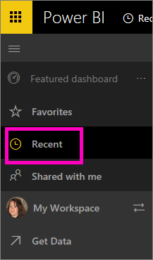

<properties
   pageTitle="Display recently-visited content in Power BI"
   description="documentation for recents in Power BI"
   services="powerbi"
   documentationCenter=""
   authors="mihart"
   manager="mblythe"
   backup=""
   editor=""
   tags=""
   qualityFocus="no"
   qualityDate=""/>

<tags
   ms.service="powerbi"
   ms.devlang="NA"
   ms.topic="article"
   ms.tgt_pltfrm="NA"
   ms.workload="powerbi"
   ms.date="11/10/2016"
   ms.author="mihart"/>

# **Recent** content in Power BI service

## What is recent content
Recent content is the last 20 items you visited.  This includes: dashboards, reports, and workbooks.

## Display recent content

To display your recent items, select **Recent** from the left navbar.

From here you can interact with the content as you would on the individual [**Dashboards**](powerbi-service-new-dashboards.md), [**Reports**](powerbi-service-new-reports.md), and [**Workbooks**](powerbi-service-new-workbooks.md) tabs.

##  See also

[Power BI - Basic Concepts](powerbi-service-basic-concepts.md)

More questions? [Try the Power BI Community](http://community.powerbi.com/)
