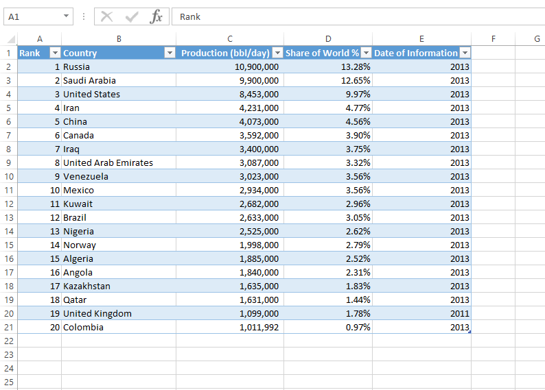

<properties pageTitle="Refresh Excel data stored in OneDrive" description="Refresh Excel data stored in OneDrive" services="powerbi" documentationCenter="" authors="v-anpasi" manager="mblythe" editor=""/>
<tags ms.service="powerbi" ms.devlang="NA" ms.topic="article" ms.tgt_pltfrm="NA" ms.workload="powerbi" ms.date="06/26/2015" ms.author="v-anpasi"/>
#Refresh Excel data stored in OneDrive

[← Files in Power BI](https://support.powerbi.com/knowledgebase/topics/88767-files-in-power-bi)

Power BI can connect to your Excel workbooks in **OneDrive** and **OneDrive for Business**. The steps for making this connection are covered in [Excel data](http://support.powerbi.com/knowledgebase/articles/424871-connect-to-excel-data).

##Why import from OneDrive?

If your Excel workbook is in the cloud, in OneDrive, then when the data in the workbook changes, Power BI can [refresh the data](http://support.powerbi.com/knowledgebase/articles/474669-refresh-data-in-power-bi) from the workbook in OneDrive; you don't need to re-upload the workbook to Power BI. (By contrast, if your workbook is on your computer rather than in OneDrive, then Power BI can't refresh the data without you re-uploading the workbook to Power BI.)  
##How refresh works

Power BI refreshes datasets from OneDrive once every hour. If you open your workbook from OneDrive in Excel or Excel Online, update the data, and save your changes, you'll see the updated data reflected in your dashboards and reports within an hour.

You can also click **REFRESH NOW** on the dataset at any time to refresh the data:

### Workbook with tables

The data in your workbook may comprise simple tables of data on worksheets, such as the following table:

When the data in these tables changes and Power BI refreshes the dataset, the data in the dataset will update accordingly.

 > **NOTE**: Avoid changing the structure of the table itself. If you add a column, Power BI ignores the added column. If you rename or delete a column, refresh fails with an error:

  
### Workbook with a Data Model

If you have a more sophisticated workbook that connects to databases or other data sources and contains a Data Model, you can also schedule Power BI to refresh data from these data sources. For more information, see [Configuring Data Refresh](http://support.powerbi.com/knowledgebase/articles/474669).

### Power View sheets

If your workbook contains Power View sheets, then when those sheets change, Power BI will import the updated sheets and overwrite the associated report in Power BI. If you'd made any changes to the report in Power BI, you'll lose those changes.

 
##See Also:

[Get data](http://support.powerbi.com/knowledgebase/articles/434354-get-data)  
[Get started with Power BI](http://support.powerbi.com/knowledgebase/articles/430814-get-started-with-power-bi)  
[Power BI - Basic Concepts](http://support.powerbi.com/knowledgebase/articles/487029-power-bi-preview-basic-concepts)
