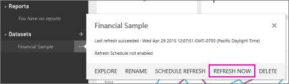

<properties 
   pageTitle="Refresh Excel, CSV, and Power BI Desktop files stored in OneDrive"
   description="Refresh Excel, CSV, and Power BI Desktop files stored in OneDrive"
   services="powerbi" 
   documentationCenter="" 
   authors="v-anpasi" 
   manager="mblythe" 
   editor=""
   tags=""/>
 
<tags
   ms.service="powerbi"
   ms.devlang="NA"
   ms.topic="article"
   ms.tgt_pltfrm="NA"
   ms.workload="powerbi"
   ms.date="09/28/2015"
   ms.author="v-anpasi"/>
# Refresh Excel, CSV, and Power BI Desktop files stored in OneDrive

Power BI can connect to your Excel, CSV, and Power BI Desktop files in **OneDrive** and **OneDrive for Business**. Read about how to [get Excel and Power BI Desktop files into Power BI](https://support.powerbi.com/knowledgebase/articles/597003).

**NOTE**: You can connect to any Excel workbook (XLSX or XLSM) that's in OneDrive for Business, and explore the whole file in Power BI, exactly as you would in Excel Online. Read about [bringing whole Excel files into Power BI](https://support.powerbi.com/knowledgebase/articles/640168).

## Why connect to files on OneDrive?

If your Excel, CSV, or Power BI Desktop file is in the cloud, in OneDrive, then when the data in the file changes, Power BI can [refresh the data](powerbi-refresh-data.md) from the file in OneDrive. You don't need to re-upload the file to Power BI. (By contrast, if your file is on your computer rather than in OneDrive, you have to re-upload the file to Power BI and [replace the existing file](https://support.powerbi.com/knowledgebase/articles/655108).)

**NOTE**: Avoid changing the structure of the data. If you rename or delete a column, any visuals based on that column will be broken. If you add a column, Power BI ignores the added column in existing visuals, but adds the new column to the dataset, so you can use it in creating or updating visuals. 

## How refresh works

Power BI refreshes datasets from OneDrive once every hour. If you update the data in the file on OneDrive and save your changes, you'll see the updated data reflected in your dashboards and reports within an hour.

You can also click **REFRESH NOW** on the dataset at any time to refresh the data.

### Excel workbook with tables

The data in your workbook may comprise simple tables of data on worksheets, such as the following table:

When the data in these tables changes and Power BI refreshes the dataset, the data in reports and dashboards based on the dataset in Power BI will update accordingly.

### Excel and Power BI Desktop files with data connections

If you have an Excel or Power BI Desktop file that connects to databases or other data sources, you can also schedule Power BI to refresh data from these data sources. For more information, see [Configuring Data Refresh](powerbi-refresh-data.md).

### Power View sheets in an Excel workbook

If your workbook contains Power View sheets, then when those sheets change, Power BI will import the updated sheets and overwrite the associated report in Power BI. If you'd made any changes to the report in Power BI, you'll lose those changes.

## See also

[Get data](powerbi-service-get-data.md)

[Get started with Power BI](powerbi-service-get-started.md) 

[Power BI - Basic Concepts](powerbi-service-basic-concepts.md)

