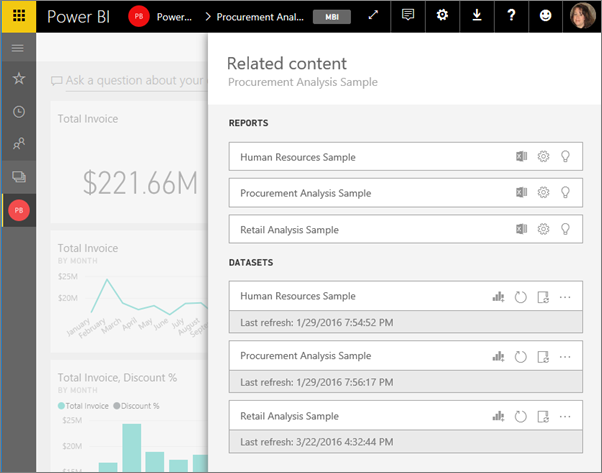
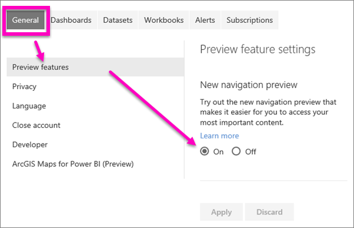
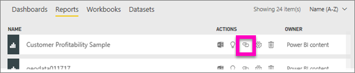
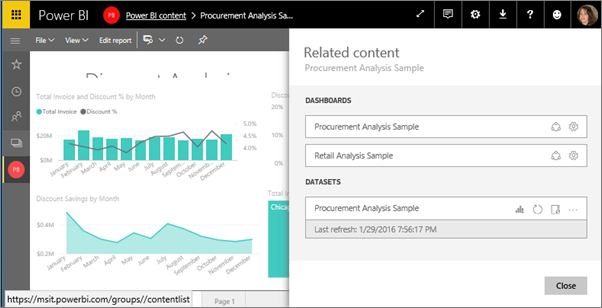

<properties
   pageTitle="View related content in Power BI service"
   description="Navigation made easier, view related content in dashboards, reports, and datasets"
   services="powerbi"
   documentationCenter=""
   authors="mihart"  
   manager="erikre"
   backup=""
   editor=""
   tags=""
   featuredVideoId=""
   qualityFocus="no"
   qualityDate=""/>

<tags
   ms.service="powerbi"
   ms.devlang="NA"
   ms.topic="article"
   ms.tgt_pltfrm="NA"
   ms.workload="powerbi"
   ms.date="03/29/2017"
   ms.author="mihart"/>

# View related content in Power BI service
The **Related content** pane shows you how your Power BI service content -- dashboards, reports, and datasets -- are interconnected.  Even better, from this pane you can perform common task such as refreshing, renaming, generating insights, and so much more. Select a related report or dashboard, and it opens in your Power BI workspace.   

As you've probably already discovered, reports are built on datasets, report visualizations are then pinned to dashboards, and dashboard visuals link back to reports. But how do you know which dashboards are hosting visualizations from your Marketing report? And how do you locate those  dashboards? Is your Procurement dashboard using visualizations from more than one dataset? If so, what are they named and how can you open and edit them? Is your HR dataset being used in any reports or dashboards at all or can it be moved without causing any broken links? Questions like these can all be answered on the **Related content** pane.  Not only does the pane display the related content, it also allows you take action on the content and easily navigate between the related content.

## Enable the new navigation preview

1.  To get started, make sure you’ve enabled the new navigation preview. From Power BI service, select the cog icon  and choose **Settings**.

    

2.   Select the **General** tab and choose **Preview features**. Turn **On** the New navigation preview and select **Apply**.

    

##   View related content for a dashboard         
 
You'll need at least *view* permissions to a dashboard to open the **Related content** pane. In this example we're using the [Procurement Analysis sample](powerbi-sample-procurement-analysis.md).

**Method 1**

In a workspace, select the **Dashboards** tab and then select the **View related** icon   .

 
**Method 2**

With a dashboard open, select    from the top menubar. The **Related content** pane opens. It shows all the reports that have visuals pinned to the dashboard and their associated datasets. For this dashboard, there are visualizations pinned from 3 different reports and those reports are based on 3 different datasets.

 
From here, you can take direct action on the related content.  For example, select a report name to open it.  For a listed report, select an icon to [analyze in Excel](powerbi-service-analyze-in-excel.md), [rename](powerbi-service-rename-a-report.md), or [get insights](powerbi-service-auto-insights.md). For a dataset, select an icon to [create a new report](powerbi-service-create-a-new-report.md), [refresh](powerbi-refresh-data.md), rename, [analyze in Excel](powerbi-service-analyze-in-excel.md), [get insights](powerbi-service-auto-insights.md), or open the **Settings** window for the dataset.  
 
##  View related content for a report

You'll need at least *view* permissions to a report to open the **Related content** pane. In this example we're using the [Procurement Analysis sample](powerbi-sample-procurement-analysis.md).

**Method 1**

In a workspace, select the **Reports** tab and then select the **View related** icon   .

 
**Method 2**

Open the report in [Reading view](powerbi-service-interact-with-a-report-in-reading-view.md) and  select    from the top menubar. The **Related content** pane opens. It shows the associated dataset and all dashboards that have at least one tile pinned from the report. For this report, there are visualizations pinned to 2 different dashboards.

 
From here, you can take direct action on the related content.  For example, select a dashboard name to open it.  For any dashboard in the list, select an icon to [share the dashoard with others](powerbi-service-share-unshare-dashboard.md) or to open the **Settings** window for the dashboard. For the dataset, select an icon to [create a new report](powerbi-service-create-a-new-report.md), [refresh](powerbi-refresh-data.md), rename, [analyze in Excel](powerbi-service-analyze-in-excel.md), [get insights](powerbi-service-auto-insights.md), or open the **Settings** window for the dataset.  

##  View related content for a dataset

You'll need at least *view* permissions to a dataset to open the **Related content** pane. In this example we're using the [Procurement Analysis sample](powerbi-sample-procurement-analysis.md).

In a workspace, select the **Datasets** tab and locate the **View related** icon   .

Select the icon to open the **Related content** pane.

 
From here, you can take direct action on the related content.  For example, select a dashboard or report name to open it.  For any dashboard in the list, select an icon to [share the dashoard with others](powerbi-service-share-unshare-dashboard.md) or to open the **Settings** window for the dashboard. For a report, select an icon to [analyze in Excel](powerbi-service-analyze-in-excel.md), [rename](powerbi-service-rename-a-report.md), or [get insights](powerbi-service-auto-insights.md).  

##  Limitations and troubleshooting

- If your browser doesn't have enough space, you won't see an option for **View related** but you will still see the View related icon    . Select the icon to open the **Related content** pane.

- To open Related content for a report, you need to be in [Reading view](powerbi-service-interact-with-a-report-in-reading-view.md).

### See also

-  [Get started with Power BI service](powerbi-service-get-started.md)

- More questions? [Try the Power BI Community](http://community.powerbi.com/)
