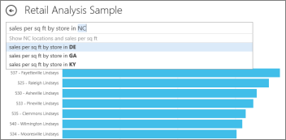
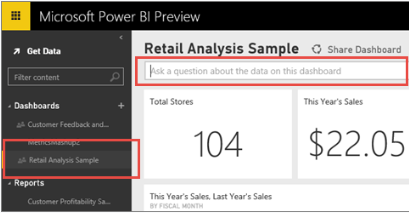

<properties pageTitle="Q&A in Power BI Preview" description="Q&A in Power BI Preview" services="powerbi" documentationCenter="" authors="v-anpasi" manager="mblythe" editor=""/> 
<tags ms.service="powerbi" ms.devlang="NA" ms.topic="article" ms.tgt_pltfrm="NA" ms.workload="powerbi" ms.date="06/16/2015" ms.author="v-anpasi"/>
# Q&A in Power BI Preview
[← Getting Started](https://support.powerbi.com/knowledgebase/topics/63037-getting-started)

Sometimes the fastest way to get an answer from your data, is to ask a question using natural language.  For example, "what were total sales last year."  Use Q&A to explore your Excel data using intuitive, natural language capabilities and receive answers in the form of charts and graphs. Q&A is different from a search engine -- Q&A only provides results about the data in Power BI.

How does Q&A know how to answer data-specific questions? It relies on the names of the tables, columns, and calculated fields in a workbook or other dataset. So what you call things in your workbook is important!

Read more about [preparing a workbook for Q&A](http://support.powerbi.com/knowledgebase/articles/474690-how-to-make-q-a-work-with-your-data), [pinning a tile to the dashboard from Q&A](http://support.powerbi.com/knowledgebase/articles/424874-pin-a-tile-to-a-dashboard-from-the-question-box), and [asking the right questions of your Salesforce dataset](http://support.powerbi.com/knowledgebase/articles/475138-ask-the-right-questions-of-salesforce-data).

## Q&A basic concepts

The Q&A text box is located at the top of a dashboard. To see and use Q&A, a dashboard name must be selected in the navigation pane.

As you type a question, Power BI Q&A picks the best visualization to display your answer; and the visualization changes dynamically as you modify the question.

When you type a query, Power BI looks for an answer in any dataset that has a tile on that dashboard.  If all the tiles are from *datasetA*, then your answer will come from *datasetA*.  If there are tiles from *datasetA* and *datasetB*, then Q&A will search for the best answer from those 2 datasets.

**TIP**:  So be careful, if you only have one tile from *datasetA* and you remove it from your dashboard, Q&A will no longer have access to *datasetA*.

For more information, see [Power Bi Preview - basic concepts](http://support.powerbi.com/knowledgebase/articles/487029).

## Types of questions to ask of an uploaded Excel workbook

When you have a workbook prepared for Q&A, you are on your way to start asking questions. Here’s a sample of the types of questions you can ask:

- Show &lt;table\>  
	Examples:  
	Show sales  
	Show orders

- Average &lt;column\> (if the column has number values)  
	Example: Average employee age

- Show &lt;column\>, where &lt;column\> is between &lt;range\>  
    Examples:  
	Show products, where price is between $10 and $30  
	Show sales, where date is between 2012 and 2014

-   Show &lt;column\>, where &lt;column\> is before &lt;value\>  
    Examples:  
	Show products, where date sold is before December 9th, 2014  
	Show employees, where date of birth is after 3/3/1985

-   &lt;measure\> by &lt;column name\>  
	a. Year over year growth by year  
	b. Total sales by product  
	c. Number of sales by location  
	d. Total profit and total cost by product

-   &lt;measure\> by &lt;column name\> for &lt;specific entity within another column\>  
	Example: Total sales by sales rep for Surface Pro 3

## See Also:

[Power Bi Preview - Basic Concepts](http://support.powerbi.com/knowledgebase/articles/487029-power-bi-preview-basic-concepts)  
[Get started with Power BI Preview](http://support.powerbi.com/knowledgebase/articles/430814-get-started-with-power-bi)  
[Tutorial: Introduction to Power BI Q&A](https://support.powerbi.com/knowledgebase/articles/607113)  
[Make your data work well with Power BI Q&A](https://support.powerbi.com/knowledgebase/articles/607113)