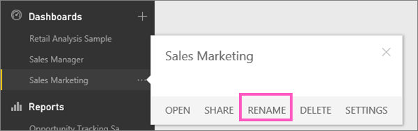
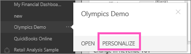

<properties 
   pageTitle="Rename a Power BI dashboard"
   description="Rename a Power BI dashboard"
   services="powerbi" 
   documentationCenter="" 
   authors="mihart" 
   manager="mblythe" 
   editor=""
   tags=""/>
 
<tags
   ms.service="powerbi"
   ms.devlang="NA"
   ms.topic="article"
   ms.tgt_pltfrm="NA"
   ms.workload="powerbi"
   ms.date="10/14/2015"
   ms.author="mihart"/>
# Rename a Power BI dashboard

Right-click the dashboard name and select **Rename**.

## Having trouble renaming a dashboard?

-   If the dashboard has this icon 

A sharing icon  tells you that the dashboard is being [shared](powerbi-service-share-unshare-dashboard.md)with you or is part of an organizational content pack.  

-   Shared dashboards are read-only and can't be renamed. 

-   If the dashboard is part of a content pack, you can Personalize it and rename it that way.

    

Read more [tips for designing your dashboard](powerbi-service-tips-for-designing-a-great-dashboard.md).

## See Also:

[Dashboards in Power BI](powerbi-service-dashboards.md)

[Power BI - Basic Concepts](powerbi-service-basic-concepts.md)

