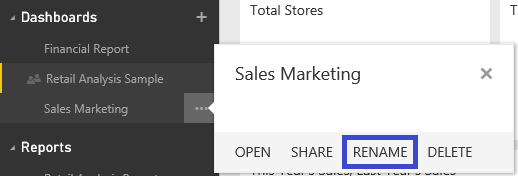

<properties pageTitle="Rename a Power BI dashboard" description="Rename a Power BI dashboard" services="powerbi" documentationCenter="" authors="v-anpasi" manager="mblythe" editor=""/>
<tags ms.service="powerbi" ms.devlang="NA" ms.topic="article" ms.tgt_pltfrm="NA" ms.workload="powerbi" ms.date="06/26/2015" ms.author="v-anpasi"/>
# Rename a Power BI dashboard
[← All about dashboards](https://support.powerbi.com/knowledgebase/topics/65158-all-about-dashboards)

Right-click the dashboard name and select **Rename.**

A people icon  tells you that the dashboard is being [shared](http://support.powerbi.com/knowledgebase/articles/431008-share-a-dashboard) with you.  Shared dashboards are read-only and can't be renamed or deleted.

Read more [tips for designing your dashboard](http://support.powerbi.com/knowledgebase/articles/433616-tips-for-designing-a-great-dashboard).

## See Also:

[Dashboards in Power BI](http://support.powerbi.com/knowledgebase/articles/424868-dashboards-in-power-bi)  
[Power BI - Basic Concepts](http://support.powerbi.com/knowledgebase/articles/487029-power-bi-preview-basic-concepts)