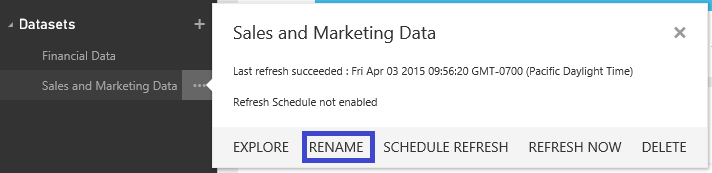

<properties pageTitle="Rename a dataset in Power BI" description="Rename a dataset in Power BI" services="powerbi" documentationCenter="" authors="v-anpasi" manager="mblythe" editor=""/>
<tags ms.service="powerbi" ms.devlang="NA" ms.topic="article" ms.tgt_pltfrm="NA" ms.workload="powerbi" ms.date="06/26/2015" ms.author="v-anpasi"/>
# Rename a dataset in Power BI

[← Get data](https://support.powerbi.com/knowledgebase/topics/63369-get-data)

You can rename datasets. In the navigation pane, right-click the dataset to be renamed and click **Rename.**

  

## See also

[Get started with Power BI](http://support.powerbi.com/knowledgebase/articles/430814-get-started-with-power-bi)  
[Get Data](http://support.powerbi.com/knowledgebase/articles/434354-get-data)  
[Power BI - Basic concepts](http://support.powerbi.com/knowledgebase/articles/487029-power-bi-preview-basic-concepts)