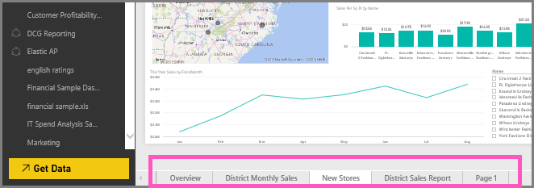

<properties
   pageTitle="Rename a report page in Power BI"
   description="Rename a report page in Power BI"
   services="powerbi"
   documentationCenter=""
   authors="mihart"
   manager="mblythe"
   editor=""
   tags=""/>

<tags
   ms.service="powerbi"
   ms.devlang="NA"
   ms.topic="article"
   ms.tgt_pltfrm="NA"
   ms.workload="powerbi"
   ms.date="02/24/2016"
   ms.author="mihart"/>
# Rename a report page in Power BI

##  What happens when I rename a report page?

Don't like the name of a page in your Power BI report?  A new name is just a click away. 

1.  Open the report in [Editing View](powerbi-service-go-from-reading-view-to-editing-view.md).

2. Locate the report page tabs at the bottom of the Power BI window.

    

2.  Open the report page that you'd like to rename by selecting the tab.

4. Double-click the name on the tab to highlight it.  

  

5. Type a new report page name and select ENTER.

  

##  See also

[Rename a report](powerbi-service-rename-a-report.md)

Read more about [reports in Power BI](powerbi-service-reports.md)

[Power BI - Basic Concepts](powerbi-service-basic-concepts.md)**
