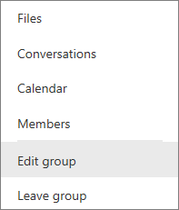

<properties
   pageTitle="Rename a Power BI dashboard, report, workbook, dataset or workspace"
   description="How to rename almost anything in Power BI service."
   services="powerbi"
   documentationCenter=""
   authors="mihart"
   manager="mblythe"
   backup=""
   editor=""
   tags=""
   qualityFocus="no"
   qualityDate=""/>

<tags
   ms.service="powerbi"
   ms.devlang="NA"
   ms.topic="article"
   ms.tgt_pltfrm="NA"
   ms.workload="powerbi"
   ms.date="11/10/2016"
   ms.author="mihart"/>

# Rename almost anything in Power BI service
This article teaches you how to rename a dashboard, report, workbook, dataset, and workspace in Power BI service.

## Rename a dashboard, report, or workbook
Dashboards, reports, and workbooks that you own can be renamed.  If it has been shared with you, you will not be able to rename it.

1.  Start in a workspace and select the **Dashboards**, **Reports**, or **Workbooks** tab. Hover over the item to rename, and select the gear icon .

2.  Type the new name and select **Save**.

    

## Rename a dataset

1.  Start in a workspace and select the **Datasets**, tab.

2. Hover over the item to rename, select the ellipses (...), and choose **Rename**.  

      

      >[AZURE.NOTE] The options in the dropdown will vary. If you don't own the dataset, you won't be able to rename it.

3.  Type a new dataset name and select **Save**.

      

## Rename a workspace
Group workspaces can be renamed by editing the group name.

1.  Start in the workspace you'd like to rename.

2. In the top-right corner, select the ellipses (...) and choose **Edit group**.  

   

3.  Type a new group name and select **Save**.

      

## Having trouble renaming?

-   If the item to be renamed has been shared with you, or is part of a content pack, you won't see the gear icon and you won't have access to Settings.

## See also
[Power BI dashboards](powerbi-service-new-dashboards.md)

[Power BI - Basic Concepts](powerbi-service-basic-concepts.md)

More questions? [Try the Power BI Community](http://community.powerbi.com/)
