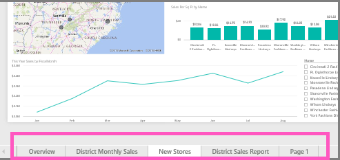

<properties
   pageTitle="Rename dashboards, reports, workspaces, report pages, datasets"
   description="Rename almost anything in Power BI service."
   services="powerbi"
   documentationCenter=""
   authors="mihart"
   manager="erikre"
   backup=""
   editor=""
   tags=""
   qualityFocus="no"
   qualityDate=""/>

<tags
   ms.service="powerbi"
   ms.devlang="NA"
   ms.topic="article"
   ms.tgt_pltfrm="NA"
   ms.workload="powerbi"
   ms.date="04/19/2017"
   ms.author="mihart"/>

# Rename almost anything in Power BI service
This article teaches you how to rename a dashboard, report, report page, workbook, dataset, app, and workspace in Power BI service.

**Can I change the name?**
|Content type  |I'm the author or creator  |Shared with me  |
|---------|---------|---------|
|Dashboard     |   yes      |   If the group owner has given you Admin or edit permissions in the app workspace     |
|Report     |   yes      |         |
|Workbook     |    yes     |         |
|Dataset     |   yes      |   not if ...      |
|App workspace    |    Yes, if you have Admin permissions     |    no, it's the name of the Office 365 group     |
|App itself    |    not from the App screen, but the app name can be changed from the app workspace if you have Admin permissions    |    no    |
|Report page    |  yes  |    |
|Content in **Shared with me**    | na    | no    |

## Rename a dashboard, report, or workbook

1.  Start in a workspace and select the **Dashboards**, **Reports**, or **Workbooks** tab. Hover over the item to rename, and select the gear icon .
 
    

2.  On the Settings page, type the new name and select **Save**.

    

## Rename a dataset

1.  Start in a workspace and select the **Datasets** tab.

    

2. Hover over the item to rename, select the ellipses (...), and choose **Rename**.  

      

      >[AZURE.NOTE] The options in the dropdown will vary. 

3.  On the Settings page, type a new name and select **Save**.

      

## Rename an App workspace
App workspaces can be renamed by editing the group name.

1.  Start in the workspace you'd like to rename.

2. In the top-right corner, select the ellipses (...) and choose **Edit group**.  

   

3.  Type a new dataset name and select **Save**.

      

## Rename page in a report
Don't like the name of a page in your Power BI report?  A new name is just a click away. Pages can be renamed in [report Editing view ](powerbi-service-interact-with-a-report-in-editing-view.md).

<iframe width="560" height="315" src="https://www.youtube.com/embed/UOKbxTXZrWw?list=PL1N57mwBHtN0JFoKSR0n-tBkUJHeMP2cP" frameborder="0" allowfullscreen></iframe>

1.  Open the report in [Editing View](powerbi-service-go-from-reading-view-to-editing-view.md).

2. Locate the report page tabs at the bottom of the Power BI window.

    

2.  Open the report page that you'd like to rename by selecting the tab.

4. Double-click the name on the tab to highlight it.  

    

5. Type a new report page name and select ENTER.

    

## Considerations and troubleshooting

-   If the item to be renamed has been shared with you, or is part of a content pack, you won't see the gear icon and you won't have access to Settings.

-    On the **Datasets** tab, if you don't see the ellipses (...), expand your browser window.

More questions? [Try the Power BI Community](http://community.powerbi.com/)
