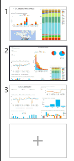

<properties
   pageTitle="Reorder pages in a report in Power BI"
   description="Reorder pages in a report in Power BI"
   services="powerbi"
   documentationCenter=""
   authors="mihart"
   manager="mblythe"
   editor=""
   tags=""
   qualityFocus="no"
   qualityDate=""/>

<tags
   ms.service="powerbi"
   ms.devlang="NA"
   ms.topic="article"
   ms.tgt_pltfrm="NA"
   ms.workload="powerbi"
   ms.date="02/23/2016"
   ms.author="mihart"/>

# Reorder pages in a report in Power BI  

In Power BI, drag the tab where you want it in the report and let go.  

## See Also  
Read more about [reports in Power BI](powerbi-service-reports.md)  
[Power BI - Basic Concepts](powerbi-service-basic-concepts.md)  
