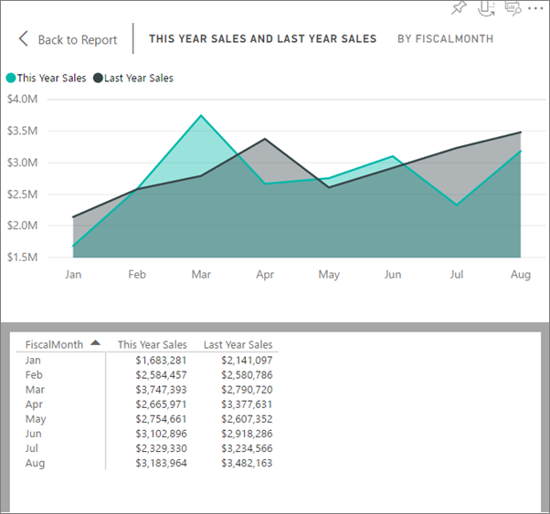

<properties
   pageTitle="See the data used to create the visual"
   description="This document shows how to view the data used to create a visual in Power BI."
   services="powerbi"
   documentationCenter=""
   authors="mihart"
   manager="mblythe"
   backup=""
   editor=""
   tags=""
   qualityFocus="no"
   qualityDate=""/>

<tags
   ms.service="powerbi"
   ms.devlang="NA"
   ms.topic="article"
   ms.tgt_pltfrm="NA"
   ms.workload="powerbi"
   ms.date="09/12/2016"
   ms.author="mihart"/>

# Reveal the data behind the visual

A Power BI visual is constructed using data from your datasets. If you're interested in seeing behind-the-scenes, Power BI lets you reveal the data that is being used to create the visual.

1.  In Power BI service, open a report in [Reading View](powerbi-service-open-a-report-in-reading-view.md) or [Editing View](powerbi-service-go-from-reading-view-to-editing-view.md), and select a visual.  In Power BI Desktop, open Report view.

2.  To see the data behind the visual, select **Explore** > **See data**.

3.  By default, the data displays below the visual.  To change this, in the top right corner of the visual, select the **Switch to vertical layout** icon .

    

4.  To export the data to a .csv file, select **Export data**.

    

5. To hide the data, either de-select **Explore** > **See data** or select the **Hide data** icon  from the top right corner of the visual.

### See also

[Visualizations in Power BI reports](powerbi-service-visualizations-for-reports.md)

[Power BI reports](powerbi-service-reports.md)

[Power BI - Basic Concepts](powerbi-service-basic-concepts.md)

More questions? [Try the Power BI Community](http://community.powerbi.com/)
