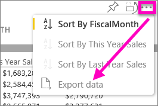

<properties
   pageTitle="See the data used to create the visual"
   description="This document shows how to view the data used to create a visual in Power BI and how to export that data to a .csv file."
   services="powerbi"
   documentationCenter=""
   authors="mihart"
   manager="erikre"
   backup=""
   editor=""
   tags=""
   qualityFocus="no"
   qualityDate=""/>

<tags
   ms.service="powerbi"
   ms.devlang="NA"
   ms.topic="article"
   ms.tgt_pltfrm="NA"
   ms.workload="powerbi"
   ms.date="05/30/2017"
   ms.author="mihart"/>

# See data used to create the visual

## See Data

A Power BI visualization is constructed using data from your datasets. If you're interested in seeing behind-the-scenes, Power BI lets you *display* the data that is being used to create the visual. When you select **See Data**, Power BI displays the data below (or next to) the visualization.

You can also export the data that is being used to create the visualization as an .xlsx or .csv file and view it in Excel. For more information, see [Export data from Power BI visualizations](powerbi-service-export-data.md).

>  [AZURE.NOTE] *See Data* and *Export Data* are both available in Power BI service and Power BI Desktop. However, Power BI Desktop provides one additional layer of detail; [*See Records* displays the actual rows from the dataset](powerbi-desktop-see-data-see-records.md).

## Using *See Data* in Power BI service
1.  In Power BI service, open a report in [Reading View](powerbi-service-open-a-report-in-reading-view.md) or [Editing View](powerbi-service-go-from-reading-view-to-editing-view.md), and select a visual.  In Power BI Desktop, open Report view.

2.  To see the data behind the visual, select **Explore** > **See data**.

    

3.  By default, the data displays below the visual.

    

4.  To change the orientation, select vertical layout  from the top-right corner of the visualization.

    

5. To export the data to a .csv file, select the ellipses and choose **Export data**.

    

    For more information on exporting the data to Excel, see [Export data from Power BI visualizations](powerbi-service-export-data.md).

6.  To hide the data, de-select **Explore** > **See data**.

### Next steps

[Export data from Power BI visualizations](powerbi-service-export-data.md)    
[Visualizations in Power BI reports](powerbi-service-visualizations-for-reports.md)    
[Power BI reports](powerbi-service-reports.md)    
[Power BI - Basic Concepts](powerbi-service-basic-concepts.md)    
More questions? [Try the Power BI Community](http://community.powerbi.com/)
