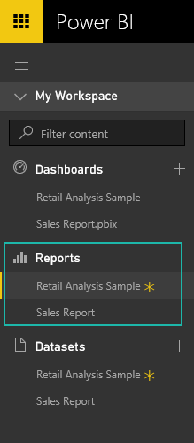

<properties 
   pageTitle="Reports in Power BI"
   description="Reports in Power BI"
   services="powerbi" 
   documentationCenter="" 
   authors="mihart" 
   manager="mblythe" 
   editor=""
   tags=""/>
 
<tags
   ms.service="powerbi"
   ms.devlang="NA"
   ms.topic="article"
   ms.tgt_pltfrm="NA"
   ms.workload="powerbi"
   ms.date="09/28/2015"
   ms.author="mihart"/>
# Reports in Power BI

Dashboards, reports, and datasets are at the heart of Power BI. A **report** is a multi-perspective view into your data, with visualizations that represent different findings and insights from that data.  A report may have a single visualization or pages full of visualizations.

Need help understanding the building blocks that make up Power BI?  See [Power BI - Basic Concepts](powerbi-service-basic-concepts.md).

You can [create a report from scratch](powerbi-service-create-a-new-report.md) or [have one shared with you](powerbi-service-share-unshare-dashboard.md). And for some kinds of data, Power BI will [create a report for you as it adds the dataset](powerbi-service-get-data.md).  

## For more information about reports:

[**Creating a report**](powerbi-service-create-a-new-report.md)**  **requires a [dataset](powerbi-service-get-data.md).  

View and interact with reports in either [**Reading View**](powerbi-service-interact-with-a-report-in-reading-view.md)or **[Editing View](powerbi-service-interact-with-a-report-in-editing-view.md)**. Editing View is only available to a report creator and has many more options for creating and modifying reports.

Did you participate in the Power BI Preview?  [Find out how to upgrade to the new report canvas](powerbi-service-converting-your-reports-to-the-new-report-editor.md).

[The report editor... take a tour](powerbi-service-the-report-editor-take-a-tour.md) - including the Visualizations pane, Filters pane, and Fields pane.

**[Filter and highlight data in reports](powerbi-service-about-filters-and-highlighting-in-reports.md)** -- create them in [Editing View](powerbi-service-interact-with-a-report-in-editing-view.md) and interact with them in [Reading View.](powerbi-service-interact-with-a-report-in-reading-view.md)

[**Add a page to a report**](powerbi-service-add-a-page-to-a-report.md) if you need more room.

[Reorder report pages](powerbi-service-reorder-pages-in-a-report.md) to put the most-important information first.

[**Delete a page from a report**](powerbi-service-delete-a-page-from-a-report.md), even if it's not blank.

**[Renaming a report ](powerbi-service-rename-a-report.md)**  doesn't change the name of any associated dashboard or dataset.

[**Save a report**](powerbi-service-save-a-report.md) so you can use it again and share it with colleagues. The name of the saved report is added to your Power BI navigation pane, under the **Reports** heading.

**[Delete a report](powerbi-service-delete-a-report.md)** if you don't need it any more. Deleting the report does not remove the dataset.

## View reports in the navigation pane

Power BI can have more than one report-- as you add reports, their titles are added to the list under the **Reports** heading (see screenshot below). The report you're currently viewing is highlighted. New reports have a yellow asterisk. Only one report can be open at a time.

## See Also

[Visualizations in Power BI reports](powerbi-service-visualizations-for-reports.md)

[Get Started with Power BI](powerbi-service-get-started.md) 

 [Power BI - Basic Concepts](powerbi-service-basic-concepts.md)
