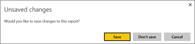
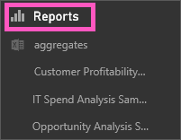
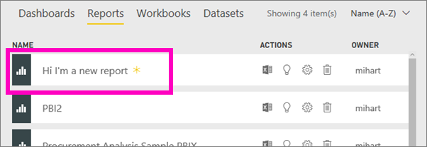

<properties
   pageTitle="Save a report in Power BI"
   description="Save a report in Power BI"
   services="powerbi"
   documentationCenter=""
   authors="mihart"
   manager="erikre"
   backup=""
   editor=""
   tags=""
   qualityFocus="no"
   qualityDate=""/>

<tags
   ms.service="powerbi"
   ms.devlang="NA"
   ms.topic="article"
   ms.tgt_pltfrm="NA"
   ms.workload="powerbi"
   ms.date="03/13/2017"
   ms.author="mihart"/>
# Save a report in Power BI

After you make changes to a report in Power BI, you can save it, save it with a new name, or just close it without saving your changes. Say you open the report, create a visualization, and pin it to your dashboard. If you close it now without saving your changes, the tile remains on the dashboard, but the visualization isn't saved in the report. When you click that tile on the dashboard, the report opens, but the visualization is gone.

>**TIP**: If you are using the [new navigation preview](powerbi-service-the-new-power-bi-experience.md) pay attention to which workspace is active so you can find the saved report. The report is saved to the active workspace.

### To save a report:

1.  If you attempt to navigate away from a report, and the report has changes, Power Bi will display a prompt.

    

2.  Another way to save the report is to select **FILE** \> **Save** or **Save As**.

   

3. If this is a new report, give it a descriptive name.  That name will appear under **Reports** in your left navbar. A yellow asterisk lets you know it's new.

    

4.  If you've installed the [new navigation preview](powerbi-service-the-new-power-bi-experience.md), your new report will appear under the **Reports** tab for the current workspace.

      

### See also

Read more about [reports in Power BI](powerbi-service-reports.md)

[Power BI - Basic Concepts](powerbi-service-basic-concepts.md)*

More questions? [Try the Power BI Community](http://community.powerbi.com/)
