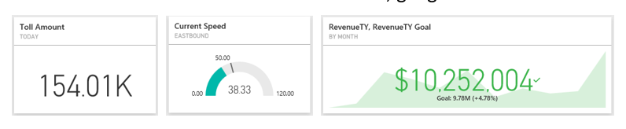
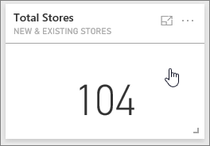
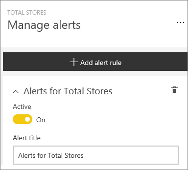
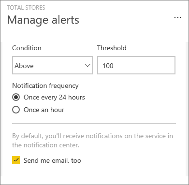

<properties
   pageTitle="Set data alerts in the Power BI service"
   description="Learn to set alerts to notify you when data in your dashboards changes beyond limits you set in Microsoft Power BI service."
   services="powerbi"
   documentationCenter=""
   authors="mihart"
   manager="mblythe"
   backup=""
   editor=""
   tags=""
   qualityFocus="no"
   qualityDate=""/>

<tags
   ms.service="powerbi"
   ms.devlang="NA"
   ms.topic="article"
   ms.tgt_pltfrm="NA"
   ms.workload="powerbi"
   ms.date="07/06/2016"
   ms.author="mihart"/>

# Data alerts in Power BI service

Set alerts to notify you when data in your dashboards changes beyond limits you set.  Alerts work for numeric tiles featuring cards, gauges, and KPIs. Only you can see the alerts you set, even if you share your dashboard. You can [set data alerts in the Power BI mobile app for iPhone](powerbi-mobile-set-data-alerts-in-the-iphone-app.md) and in the Power BI service, and see them in both places.

## Set data alerts in Power BI service

This example uses a card tile from the Retail Analysis sample dashboard.

1.  From a dashboard tile, select the ellipses.

    

2.  Select the bell icon  to add one or more alerts for **Total stores**.

    

3.  To start, ensure the slider is set to **On**, and give your alert a title.

    

4.  Scroll down and enter the alert details.  In this example we'll create an alert that notifies us once a day if the number of total stores goes above 100. Alerts will appear in our [Notification center](powerbi-service-notification-center.md). And we'll have Power BI send us an email as well.

    

5. Select **Save**.

##    Receiving alerts
When the data being tracked reaches one of the threshholds you've set, several things will happen.

1.  Power BI checks to see if it's been more than 24 hours or more than 1 hour (depending on the option you selected) since the last alert was sent.

2.  If you've set the alert to send you an email, you'll find something like this in your Inbox.

    

3.  Power BI adds a message to your [**Notification center**](powerbi-service-notification-center.md) and adds a new alert icon to the applicable tile.

    

4. Open your Notification center to see the alert details.

    

>**NOTE**: Alerts will only work on data that is being refreshed. When data refreshes, Power BI looks to see if an alert is set for that data. If the data has reached an alert threshold, an alert is triggered.

## Manage alerts
There are three ways to manage your alerts: From the dashboard tile itself, from the Power BI Settings menu, and [on an individual tile on an iPhone](powerbi-mobile-set-data-alerts-in-the-iphone-app.md).

###   From the tile itself

1. If you need to change or remove an alert for a tile, re-open the **Manage alerts** window by selecting the bell icon . All the alerts that you've set for that tile are displayed.

    .

2. To modify an alert, select the arrow to the left of the alert name.

    .

3. To delete an alert, select the trashcan to the right of the alert name.

      

###   From the Power BI settings menu
1. Select the gear icon from the Power BI menubar.

    .

2. Under **Settings** select **Alerts**.

    

3. From here you can turn alerts on and off, open the **Manage alerts** window to make changes, or delete the alert.

## Tips and troubleshooting

-  You can only set alerts for dashboards that you own, not those that have been shared with you.

-  Alerts are currently not supported for Bing tiles, or card tiles with date/time measures.

-  Alerts only work with numeric data types.

-  Alerts only work on data that is refreshed. They do not work on static data.

### See also
- [Set data alerts on your iphone](powerbi-mobile-set-data-alerts-in-the-iphone-app.md)
- [Get started with Power BI](powerbi-service-get-started.md)
