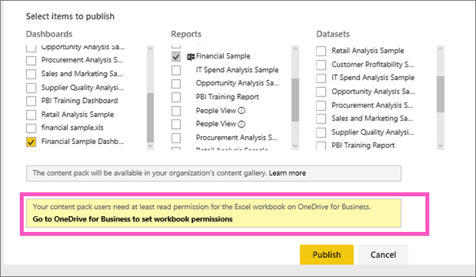

<properties
   pageTitle="Share a dashboard that links to an Excel workbook on OneDrive for Business"
   description="Share a dashboard that has links to an Excel workbook on OneDrive for Business"
   services="powerbi"
   documentationCenter=""
   authors="mihart"
   manager="mblythe"
   editor=""
   tags=""/>

<tags
   ms.service="powerbi"
   ms.devlang="NA"
   ms.topic="article"
   ms.tgt_pltfrm="NA"
   ms.workload="powerbi"
   ms.date="11/18/2015"
   ms.author="mihart"/>

# Share a dashboard that has links to an Excel workbook

## Use Power BI to connect to an Excel workbook on OneDrive for Business

[You can use Power BI to connect to Excel workbooks on OneDrive for Business](powerbi-bring-in-whole-excel-files.md) and pin tiles to a dashboard from that workbook. When it's time to share that dashboard, there are several things to consider.

### Considerations for sharing

When you share a dashboard or create a content pack and include a dashboard that contains workbook tiles, your colleagues will be able to see those tiles, regardless of the permissions they have for the workbook file itself.

* Your colleagues can view the tiles without needing any permissions for the workbook itself. So you can create a content pack and know that your colleagues can see the tiles created from the OneDrive Excel workbook.

* But, clicking the tile opens the workbook inside of Power BI. The workbook will only open inside Power BI if your colleague has at least [Read permissions](https://support.office.com/en-us/article/Share-documents-or-folders-in-Office-365-1fe37332-0f9a-4719-970e-d2578da4941c) to the workbook file on OneDrive for Business.

## Share a dashboard that contains workbook tiles

To share a dashboard that links back to an Excel workbook on OneDrive for Business, see [Share and Unshare a Dashboard](powerbi-service-share-unshare-dashboard.md). The difference is that you'll have the option to modify the permissions for the linked Excel workbook before sharing.

  

1. Enter the email addresses for your colleagues.

2. To enable your colleagues to view the Excel workbook from Power BI, select **Go to OneDrive for Business to set workbook permissions**.

3. On OneDrive, [modify the permissions](https://support.office.com/en-US/article/Share-files-and-folders-and-change-permissions-9fcc2f7d-de0c-4cec-93b0-a82024800c07) as needed.

4. Select **Share**.

>**NOTE**: Your colleagues will not be able to pin additional tiles from that workbook and they will not be able to make changes to the Excel workbook from Power BI.

## Create a content pack with a dashboard that contains workbook tiles
When you [publish a content pack](powerbi-service-organizational-content-pack-tutorial-create-and-publish.md) you give access to individual colleagues or groups. The steps for publishing a content pack that contains workbook links is that you'll have the option to modify the permissions for the linked Excel workbook before publishing.

1. In the **Create content pack** screen, enter email addresses, give the content pack a title and description, and upload an image.

2. Select the dashboard and/or report that is linked to the Excel workbook on OneDrive for Business.

  

3. Select **Go to OneDrive for Business to set workbook permissions**.

4. On OneDrive, [modify the permissions](https://support.office.com/en-US/article/Share-files-and-folders-and-change-permissions-9fcc2f7d-de0c-4cec-93b0-a82024800c07) as needed.

4. Select **Publish**.

## Share a dashboard from a Power BI group

Sharing a dashboard from a Power BI group is similar to sharing a dashboard from your own workspace, except that the files are located in an Office 365 group site, instead of your private OneDrive for Business. Modify the permissions for the Excel workbook before sharing the dashboard with people outside the group.

## See also

[Pin a tile to a Power BI dashboard from Excel](powerbi-service-pin-a-tile-to-a-dashboard-from-excel.md)

[Dashboards in Power BI](powerbi-service-dashboards.md)

[Get Started with Power BI](powerbi-service-get-started.md)

[Power BI - Basic Concepts](powerbi-service-basic-concepts.md)
