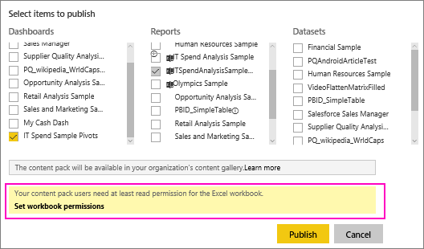

<properties
   pageTitle="Share a dashboard that links to an Excel file in OneDrive"
   description="Read about sharing dashboards connected to an Excel workbook on OneDrive for Business, with tiles pinned from that workbook."
   services="powerbi"
   documentationCenter=""
   authors="maggiesMSFT"
   manager="erikre"
   backup="ajayan"
   editor=""
   tags=""
   qualityFocus="no"
   qualityDate=""/>

<tags
   ms.service="powerbi"
   ms.devlang="NA"
   ms.topic="article"
   ms.tgt_pltfrm="NA"
   ms.workload="powerbi"
   ms.date="07/18/2017"
   ms.author="maggies"/>

# Share a dashboard that links to an Excel file in OneDrive

In Power BI, you can [connect to Excel workbooks on OneDrive for Business](powerbi-bring-in-whole-excel-files.md) and pin tiles to a dashboard from that workbook. When you share that dashboard, or create a content pack that includes that dashboard:

* Your colleagues can view the tiles without needing permissions for the workbook itself. So you can create a content pack and know that your colleagues can see the tiles created from the Excel workbook on OneDrive.

* Clicking the tile opens the workbook inside of Power BI. The workbook will only open if your colleagues have at least [read permissions](https://support.office.com/en-us/article/Share-documents-or-folders-in-Office-365-1fe37332-0f9a-4719-970e-d2578da4941c) to the workbook on OneDrive for Business.

## Share a dashboard that contains workbook tiles

To share a dashboard that links back to an Excel workbook on OneDrive for Business, see [Share a dashboard](powerbi-service-share-unshare-dashboard.md). The difference is that you have the option to modify the permissions for the linked Excel workbook before sharing.

  

1. Enter the email addresses for your colleagues.

2. To enable your colleagues to view the Excel workbook from Power BI, select **Go to OneDrive for Business to set workbook permissions**.

3. On OneDrive, [modify the permissions](https://support.office.com/en-US/article/Share-files-and-folders-and-change-permissions-9fcc2f7d-de0c-4cec-93b0-a82024800c07) as needed.

4. Select **Share**.

>**Note**: Your colleagues won't be able to pin additional tiles from that workbook, or make changes to the Excel workbook from Power BI.

## Create an organizational content pack with a dashboard that contains workbook tiles
When you [publish a content pack](powerbi-service-organizational-content-pack-tutorial-create-and-publish.md) you give access to individual colleagues or groups. When you publish a content pack that contains workbook links, you'll have the option to modify the permissions for the linked Excel workbook before publishing.

1. In the **Create content pack** screen, enter email addresses, give the content pack a title and description, and upload an image.

2. Select the dashboard and/or report that is linked to the Excel workbook on OneDrive for Business.

    

3. Select **Go to OneDrive for Business to set workbook permissions**.

4. On OneDrive, [modify the permissions](https://support.office.com/en-US/article/Share-files-and-folders-and-change-permissions-9fcc2f7d-de0c-4cec-93b0-a82024800c07) as needed.

4. Select **Publish**.

## Share a dashboard from a Power BI workspace

Sharing a dashboard from a Power BI workspace is similar to sharing a dashboard from your own workspace, except that the files are located in an Office 365 workspace site, instead of your private OneDrive for Business. Modify the permissions for the Excel workbook before sharing the dashboard with people outside the workspace.

## Next steps

- [Pin a tile to a Power BI dashboard from Excel](powerbi-service-pin-a-tile-to-a-dashboard-from-excel.md)
- [Power BI Basic Concepts](powerbi-service-basic-concepts.md)
- More questions? [Try the Power BI Community](http://community.powerbi.com/)
