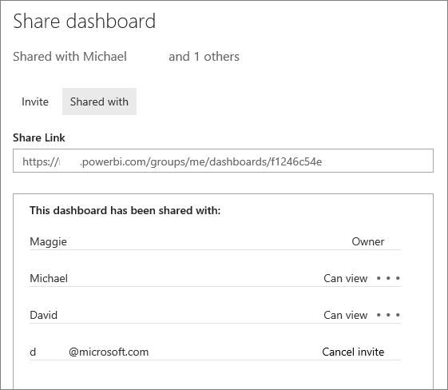

<properties
   pageTitle="Share (and unshare) a dashboard from Power BI"
   description="Share, unshare, reshare a dashboard from Power BI"
   services="powerbi"
   documentationCenter=""
   authors="maggiesMSFT"
   manager="mblythe"
   editor=""
   tags=""/>

<tags
   ms.service="powerbi"
   ms.devlang="NA"
   ms.topic="article"
   ms.tgt_pltfrm="NA"
   ms.workload="powerbi"
   ms.date="01/20/2016"
   ms.author="maggies"/>

# Share (and unshare) a dashboard from Power BI

You can share your dashboards with people in your organization. If they haven't signed up for [Power BI](http://powerbi.com), they'll need to do so to see your dashboard.

**NOTE**: Dashboards (and their associated reports) that are shared with you are read-only. You can't save-as to personalize them. On the other hand, you can personalize dashboards and reports in [organizational content packs](powerbi-service-organizational-content-packs-introduction.md). Read [How should I share my dashboard](powerbi-service-how-should-i-share-my-dashboard.md)? to decide which is best for your situation.

1.   Open the dashboard and select **Share** .

2.  Select **Invite** and type the colleagues' email addresses in the top box and, optionally, modify the message.

      

3.  To allow your colleagues to reshare your dashboard with others, check **Allow recipients to share your dashboard**.

4.  Select **Share.**

	Power BI sends your colleagues an email invitation with a link to the shared dashboard. Clicking the link adds the dashboard to their Power BI. They see this icon  next to the shared dashboard, indicating the dashboard is shared with them. 

    >**Note**: If they haven't yet signed up for Power BI, they're directed to instructions to do so.

5.  To see who you've already shared the dashboard with, select **Shared With**.

    

## Notes about sharing

When you share with your colleagues:

-   They can see your dashboard and interact with your reports in [Reading View](powerbi-service-open-a-report-in-reading-view.md). They can't create new reports or save changes to existing reports.

-   They can even see the changes you make (after you save those changes).

-   They can't see or download the dataset
  
-   They can refresh the data.

-   If you use Office 365 for email, you can share with members of a distribution group by entering in the email address associated with the distribution group in the top box. However, you can't share with distribution groups with more than 500 members.

-   You can share with colleagues who have the same email domain as you, and with colleagues whose domain is different but registered within the tenant. For example, say the domains contoso.com and contoso2.com are registered in the tenant. If your email address is konrads@contoso.com, you can share with ravali@contoso.com, and also with gustav@contoso2.com.

    **Tip:** If your colleagues already have access to a specific dashboard, you can send a direct link to that dashboard just by copying the URL when you're on the dashboard. For example:   

    https://powerbi.com/dashboards/g12466b5-a452-4e55-8634-xxxxxxxxxxxx

## Resharing

Resharing allows your colleagues to forward the email invitation to others in your organization (the invitation expires after one month). Colleagues can also reshare through the web and mobile apps. As the owner of the dashboard, you can turn off resharing and you can also revoke resharing on an individual basis (see below).

## Unshare a dashboard

1.  Open the dashboard and select **Share** .

2.  Select **Shared With** to see the complete list of people.

    

3.  Select the ellipsis (**...**) next to **Can view** and select:

    

    -   **Stop sharing** with that person or

    -   **Disable reshares** to keep that person from sharing with anyone else.

    -   Or if the person hasn't yet accepted your share invitation, **Cancel Invite**.

## Turn off resharing

Only the dashboard owner can turn resharing on and off.

-   If you haven't sent the sharing invitation yet, clear the **Allow recipients to share your dashboard** check box at the bottom of the invitation.

-   If colleagues haven't accepted your sharing invitation yet, cancel the invitation and invite them again without selecting **Allow recipients to share your dashboard**.

-   If they have accepted your sharing invitation, select **Shared With**, select the ellipsis (**...**) next to **Can view** and click **Stop sharing**.

    

### See also

[Share a dashboard that has links to an Excel file](powerbi-service-share-dashboard-that-links-to-excel.md)

[Dashboards in Power BI](powerbi-service-dashboards.md)

[Get Started with Power BI](powerbi-service-get-started.md)

[Power BI - Basic Concepts](powerbi-service-basic-concepts.md)
