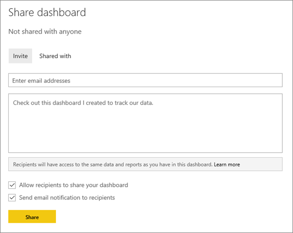
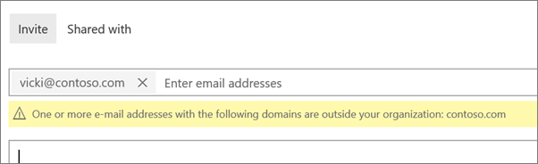
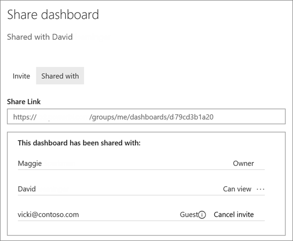

<properties
   pageTitle="Share (and unshare) a dashboard from Power BI"
   description="Share, unshare, reshare a dashboard from Power BI"
   services="powerbi"
   documentationCenter=""
   authors="maggiesMSFT"
   manager="mblythe"
   editor=""
   tags=""/>

<tags
   ms.service="powerbi"
   ms.devlang="NA"
   ms.topic="article"
   ms.tgt_pltfrm="NA"
   ms.workload="powerbi"
   ms.date="02/10/2016"
   ms.author="maggies"/>

# Share (and unshare) a dashboard from Power BI

You can share your dashboards with people in and out of your organization. If they haven't signed up for [Power BI](http://powerbi.com), they'll need to do so to see your dashboard.

Dashboards (and their associated reports) that are shared with you are read-only. You can't save-as to personalize them. On the other hand, you can personalize dashboards and reports in [organizational content packs](powerbi-service-organizational-content-packs-introduction.md). See [How should I share my dashboard](powerbi-service-how-should-i-share-my-dashboard.md)? to decide which is best for your situation.

## Share a dashboard

1.   Open the dashboard and select **Share** .

2.  Select **Invite** and type the email addresses in the top box and, optionally, modify the message.

      

    If any of the addresses is outside your organization, you'll see a warning.
 
      

3.  To allow your colleagues to reshare your dashboard with others, check **Allow recipients to share your dashboard**.
   
    Only colleagues in your organization can reshare your dashboard. People outside your organization can view your dashboard but not reshare it. 

4.  Select **Share.**

	Power BI sends an email invitation with a link to the shared dashboard. Clicking the link adds the dashboard to your colleague's Power BI service. They see this icon  next to the shared dashboard, indicating the dashboard is shared with them. 

    If they haven't yet signed up for Power BI, they can create an account after they click the link.

    >**Note**: The sharing experience is different for people outside your organization. See [When you share with people outside your organization](powerbi-service-share-unshare-dashboard.md#when-you-share-with-people-outside-your-organization) below for details.

5.  To see who you've already shared the dashboard with, select **Shared With**.

    

    People outside your organization are listed as **Guest**.

## Notes about sharing 

When you share a dashboard:

-   Everyone you share it with can see your dashboard and interact with your reports in [Reading View](powerbi-service-open-a-report-in-reading-view.md). They can't create new reports or save changes to existing reports.

-   Everyone can even see the changes you make (after you save those changes).

-   No-one can see or download the dataset.
  
-   Everyone can refresh the data.

### When you share with colleagues

-   If you use Office 365 for email, you can share with members of a distribution group by entering the email address associated with the distribution group. However, you can't share with distribution groups with more than 500 members.

-   Colleagues who have the same email domain as you, and colleagues whose domain is different but registered within the tenant, can reshare the dashboard. For example, say the domains contoso.com and contoso2.com are registered in the tenant. If your email address is konrads@contoso.com, then both ravali@contoso.com and gustav@contoso2.com can reshare.

    **Tip:** If your colleagues already have access to a specific dashboard, you can send a direct link to that dashboard just by copying the URL when you're on the dashboard. For example:   

    https://powerbi.com/dashboards/g12466b5-a452-4e55-8634-xxxxxxxxxxxx

## When you share with people outside your organization

When you share with people outside your organization, they get an email with a link to the shared dashboard. They have to sign in to Power BI to see the dashboard. If they don't have a Power BI account, they can create one after clicking the link.

After they sign in, they see the shared dashboard in its own browser window without the left navigation pane, not in their usual Power BI portal. They have to bookmark the link to access this dashboard in the future. 

They can't edit any content in this dashboard or report. They can interact with the charts in the report (cross-highlight) and change any filters/slicers available on the reports connected to the dashboard.

Only your direct recipients can see the shared dashboard. In the example above, only Vicki@contoso.com can see the dashboard. No-one else can see that dashboard, even if they have the link, and Vicki has to use the same email address to access that dashboard. If she signs up with any other email address, she won't have access to the dashboard either.

People outside your organization can't see any data if role- or row-level security is implemented on Analysis Services tabular models on-premises.

### Licensing requirements for sharing outside your organization

Sharing content outside your organization has the same licensing requirements as sharing content within your organization.

If you created your dashboard  with only free Power BI features, your recipients will just need a free Power BI license to view the content. If you used Power BI Pro features like groups or on-premises connectivity, your recipients will need a Power BI Pro license to view the content.

## Resharing

Resharing allows your colleagues to forward the email invitation to others in your organization (the invitation expires after one month). Colleagues can also reshare through the Power BI service and mobile apps. As the owner of the dashboard, you can turn off resharing and you can also revoke resharing on an individual basis (see below).

People outside your organization can't reshare.

## Unshare a dashboard

1.  Open the dashboard and select **Share** .

2.  Select **Shared With** to see the complete list of people.

    

3.  Select the ellipsis (**...**) next to **Can view** and select:

    

    -   **Stop sharing** with that person or

    -   **Disable reshares** to keep that person from sharing with anyone else.

    -   Or if the person hasn't yet accepted your share invitation, **Cancel Invite**.

## Turn off resharing

Only the dashboard owner can turn resharing on and off.

-   If you haven't sent the sharing invitation yet, clear the **Allow recipients to share your dashboard** check box at the bottom of the invitation.

-   If colleagues haven't accepted your sharing invitation yet, cancel the invitation and invite them again without selecting **Allow recipients to share your dashboard**.

-   If they have accepted your sharing invitation, select **Shared With**, select the ellipsis (**...**) next to **Can view** and click **Stop sharing**.

    

### See also

[How should I share my dashboard?](powerbi-service-how-should-i-share-my-dashboard.md)

[Share a dashboard that links to an Excel file](powerbi-service-share-dashboard-that-links-to-excel.md)

[Dashboards in Power BI](powerbi-service-dashboards.md)

[Get Started with Power BI](powerbi-service-get-started.md)

[Power BI - Basic Concepts](powerbi-service-basic-concepts.md)
