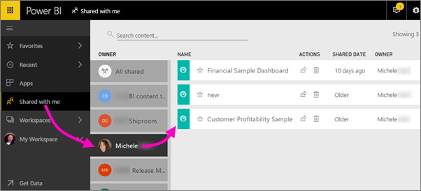

<properties
   pageTitle="Share dashboards and reports with colleagues and others"
   description="How to share Power BI dashboards and reports with colleagues in and out of your organization, and what you need to know about sharing."
   services="powerbi"
   documentationCenter=""
   authors="maggiesMSFT"
   manager="erikre"
   backup="ajayan"
   editor=""
   tags=""
   featuredVideoId="0tUwn8DHo3s"
   qualityFocus="complete"
   qualityDate="06/22/2016"/>

<tags
   ms.service="powerbi"
   ms.devlang="NA"
   ms.topic="article"
   ms.tgt_pltfrm="NA"
   ms.workload="powerbi"
   ms.date="07/17/2017"
   ms.author="maggies"/>

# Share dashboards and reports with colleagues and others

*Sharing* is one way to give other people access to your dashboards and reports. Power BI offers several ways to collaborate and distribute your dashboards, and sharing is just one. Sharing is useful if you want just a few other people to view your work. See [How should I collaborate on and share dashboards and reports?](powerbi-service-how-should-i-share-my-dashboard.md) to compare sharing with the other ways. 

Whether you share content inside or outside your organization, you and your recipients need a Power BI Pro license. See this [comparison of Power BI free and Pro](powerbi-premium.md#free-vs-pro-tiers)n.

You can share a dashboard from your own My Workspace, or from an app workspace. When you share a dashboard, those you share it with can view it and interact with it, but can't edit it. They see the same data that you see in the dashboard and reports, unless row-level security (RLS) is applied. The colleagues you share it with can share the dashboard with their colleagues, if you allow them to. The people outside your organization can view and interact with the dashboard too, but can't share it. 

You can also [share a dashboard from any of the Power BI mobile apps](powerbi-mobile-share-a-dashboard-from-the-iphone-app.md). You can share dashboards from the Power BI service and the Power BI mobile apps, but not from Power BI Desktop.

## Video: Share a dashboard
Watch Amanda share her dashboard with colleagues inside and outside her company. Then follow the step-by-step instructions below the video to try it out yourself.

<iframe width="560" height="315" src="https://www.youtube.com/embed/0tUwn8DHo3s?list=PL1N57mwBHtN0JFoKSR0n-tBkUJHeMP2cP" frameborder="0" allowfullscreen></iframe>

## Step by step: Share a dashboard

1.   In your My Workspace or in an app workspace, open a dashboard and select **Share** .

2.  In the top box, enter the full email addresses for individuals, Office 365 groups, distribution groups, or security groups. 

    > [AZURE.NOTE] You can't share with dynamic distribution lists. 

      

    If you share with people whose addresses are outside your organization, you'll see a warning.

      

2. Optionally, you can modify the message.

3.  To let your colleagues reshare your dashboard with others, check **Allow recipients to share your dashboard**.

4.  Select **Share.**

	Power BI sends an email invitation with a link to the shared dashboard. Clicking the link adds the dashboard to your recipients' **Shared with me** list page. They can select your name to see all the dashboards you've shared. 

    

    > [AZURE.NOTE]  The sharing experience is different for people outside your organization. See [When you share with people outside your organization](powerbi-service-share-unshare-dashboard.md#sharing-your-dashboard-with-people-outside-your-organization) below for details.

5.  To see who you've already shared the dashboard with, in the **Share dashboard** dialog box select **Access**.

    

    People outside your organization are listed as **Guest**.

## Notes about sharing a dashboard

Things to keep in mind about sharing dashboards:

-   Your colleagues need a Power BI Pro license to see your dashboard.

-   In general, you and your colleagues see the same data in the dashboard. Thus, if you have permissions to see more data than they do, they'll be able to see all your data in your dashboard. However, if row-level security (RLS) is applied to the dataset underlying a dashboard, then the credentials of every person are used to determine which data they can access.

-   Everyone you share it with can see your dashboard and interact with your reports in [Reading View](powerbi-service-open-a-report-in-reading-view.md). They can't create new reports or save changes to existing reports.

-   Everyone can see the changes you make.

-   No-one can see or download the dataset.

-   Everyone can manually [refresh the dashboard data](powerbi-refresh-data.md).

### Notes about sharing your dashboard with colleagues

-   If you use Office 365 for email, you can share with members of a distribution group by entering the email address associated with the distribution group.

-   Colleagues who have the same email domain as you, and colleagues whose domain is different but registered within the same tenant, can reshare the dashboard. For example, say the domains contoso.com and contoso2.com are registered in the same tenant. If your email address is konrads@contoso.com, then both ravali@contoso.com and gustav@contoso2.com can reshare, as long as you gave them permission to share.

    > [AZURE.TIP] If your colleagues already have access to a specific dashboard, you can send a direct link to that dashboard just by copying the URL when you're on the dashboard. For example:   

    https://powerbi.com/dashboards/g12466b5-a452-4e55-8634-xxxxxxxxxxxx

## Sharing your dashboard with people outside your organization

When you share with people outside your organization, they get an email with a link to the shared dashboard. They need a Power BI Pro license, and they have to sign in to Power BI to see the dashboard. If they don't have a Power BI Pro license, they can sign up for one after clicking the link.

After they sign in, they see the shared dashboard in its own browser window without the left navigation pane, not in their usual Power BI portal. They have to bookmark the link to access this dashboard in the future.

They can't edit any content in this dashboard or report. They can interact with the charts in the report (cross-highlight) and change any filters/slicers available on the reports connected to the dashboard, but can't save their changes.

Only your direct recipients can see the shared dashboard. For example, if you sent the email to Vicki@contoso.com, only Vicki can see the dashboard. No-one else can see that dashboard, even if they have the link, and Vicki has to use the same email address to access that dashboard. If she signs up with any other email address, she won't have access to the dashboard either.

People outside your organization can't see any data if role- or row-level security is implemented on on-premises Analysis Services tabular models.

If you send a link from a Power BI mobile app to people outside your organization, when they click the link the dashboard opens in a browser, not in the Power BI mobile apps.

## Sharing just a report
We've seen that when you share a dashboard with tiles that link to reports, those reports are also shared at the same time. But what if you want to share just a report? Just send the report page URL to your colleagues. As long as they have Power BI Pro licenses, are members of the same distribution group, in the same email domain as you, or have at least one dashboard that links to that same report (the dashboard has tiles that were pinned from that report), they'll be able to open the report.

## Share a filtered version of a report
What if you want to share a filtered version of a report? Maybe a report that only shows data for a specific city or salesperson or year. This can be done by creating a custom URL.

1.   Open the report in [Editing view](powerbi-service-go-from-reading-view-to-editing-view.md), apply the filter, and save the report. 

    In this example we're filtering the [Retail Analysis sample](powerbi-sample-tutorial-connect-to-the-samples.md) to only show values where **Territory** equals **NC**.

    

2.  Add the following to the end of the report page URL:

    ?filter=*tablename*/*fieldname* eq *value*

    In our example, the name of the table is **Store**, the name of the field is **Territory**, and the value we want to filter on is **NC**:

     ?filter=Store/Territory eq NC

    

    Your browser adds special characters to represent slashes and spaces, so you end up with:

    app.powerbi.com/groups/me/reports/010ae9ad-a9ab-4904-a7a1-10a61f70f2f5/ReportSection2?filter=Store%252FTerritory%20eq%20NC

    >[AZURE.NOTE]The field must be of type **string** and neither the *tablename* or *fieldname* can contain spaces.

3.  Send this URL to your colleagues. When they click the link, Power BI will open a read-only version of the filtered report.

## Resharing

Resharing allows your colleagues to forward the email invitation to others in your organization (the invitation expires after one month). Colleagues can also reshare through the Power BI service and mobile apps. As the owner of the dashboard, you can turn off resharing and you can also revoke resharing on an individual basis (see below).

People outside your organization can't reshare.

## Unshare a dashboard

1.  Open the dashboard and select **Share** .

2.  Select **Access** to see the complete list of people.

    

3.  Select the ellipsis (**...**) next to **Can view** and select:

    

    -   **Stop sharing** with that person or

    -   **Disable reshares** to keep that person from sharing with anyone else.

    -   Or if the person hasn't yet accepted your share invitation, **Cancel Invite**.

## Turn off resharing

Only the dashboard owner can turn resharing on and off.

-   If you haven't sent the sharing invitation yet, clear the **Allow recipients to share your dashboard** check box at the bottom of the invitation.

-   If colleagues haven't accepted your sharing invitation yet, cancel the invitation and invite them again without selecting **Allow recipients to share your dashboard**.

-   If they have accepted your sharing invitation, select **Access**, select the ellipsis (**...**) next to **Can view** and click **Stop sharing**.

    

## Next steps

- [How should I collaborate on and share dashboards and reports?](powerbi-service-how-should-i-share-my-dashboard.md)
- [Share a dashboard that links to an Excel file](powerbi-service-share-dashboard-that-links-to-excel.md)
- [Get Started with Power BI](powerbi-service-get-started.md)
- More questions? [Try the Power BI Community](http://community.powerbi.com/).
