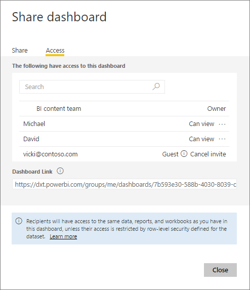

<properties
   pageTitle="Share dashboards and reports with colleagues and others"
   description="How to share Power BI dashboards and reports with colleagues in and out of your organization, and what you need to know about sharing."
   services="powerbi"
   documentationCenter=""
   authors="ajayan"
   manager="mblythe"
   backup=""
   editor=""
   tags=""
   featuredVideoId="0tUwn8DHo3s"
   qualityFocus="identified"
   qualityDate="06/22/2016"/>

<tags
   ms.service="powerbi"
   ms.devlang="NA"
   ms.topic="article"
   ms.tgt_pltfrm="NA"
   ms.workload="powerbi"
   ms.date="10/13/2016"
   ms.author="maggies"/>

# Share a dashboard and reports with colleagues and others

You can share your dashboards and reports with colleagues in and out of your organization. If they haven't signed up for [Power BI](http://powerbi.com), they'll need to do so to see your dashboard.

What you can share and who you can share it with depends on your and their Power BI licenses. See [Licensing requirements for sharing](powerbi-service-share-unshare-dashboard.md#licensing-requirements-for-sharing) below for details.

Dashboards and reports that are shared with you are read-only.  You can't save-as to personalize them. On the other hand, you can make your own copy of dashboards and reports in [organizational content packs](powerbi-service-organizational-content-packs-introduction.md).  See [How should I share my dashboard](powerbi-service-how-should-i-share-my-dashboard.md)? to decide which is best for your situation.

>**Note**: You share dashboards and reports from the Power BI service or the Power BI mobile apps, but not from Power BI Desktop.

Watch Amanda share her dashboard with colleagues inside and outside her company. Then follow the step-by-step instructions below the video to try it out yourself.

<iframe width="560" height="315" src="https://www.youtube.com/embed/0tUwn8DHo3s?list=PL1N57mwBHtN0JFoKSR0n-tBkUJHeMP2cP" frameborder="0" allowfullscreen></iframe>

## Share a dashboard

1.   Open the dashboard and select **Share** .

2.  Select **Invite** and type the email addresses in the top box and, optionally, modify the message.

      

    You can share with people whose addresses are outside your organization, but you'll see a warning.

      

3.  To allow your colleagues to reshare your dashboard with others, check **Allow recipients to share your dashboard**.

    Only colleagues in your organization can reshare your dashboard. People outside your organization can view your dashboard but not reshare it.

4.  Select **Share.**

	Power BI sends an email invitation with a link to the shared dashboard. Clicking the link adds the dashboard to your colleague's Power BI service. They see this icon  next to the shared dashboard, indicating the dashboard is shared with them.

    If they haven't yet signed up for Power BI, they can create an account after they click the link.

    >**Note**: The sharing experience is different for people outside your organization. See [When you share with people outside your organization](powerbi-service-share-unshare-dashboard.md#when-you-share-your-dashboard-with-people-outside-your-organization) below for details.

5.  To see who you've already shared the dashboard with, select **Access**.

    

    People outside your organization are listed as **Guest**.

## Notes about sharing a dashboard

When you share a dashboard:

-   Everyone you share it with can see your dashboard and interact with your reports in [Reading View](powerbi-service-open-a-report-in-reading-view.md). They can't create new reports or save changes to existing reports.

-   Everyone can even see the changes you make.

-   No-one can see or download the dataset.

-   Everyone can manually [refresh the dashboard data](powerbi-refresh-data.md).

### When you share your dashboard with colleagues

-   If you use Office 365 for email, you can share with members of a distribution group by entering the email address associated with the distribution group.

-   Colleagues who have the same email domain as you, and colleagues whose domain is different but registered within the tenant, can reshare the dashboard. For example, say the domains contoso.com and contoso2.com are registered in the tenant. If your email address is konrads@contoso.com, then both ravali@contoso.com and gustav@contoso2.com can reshare.

    **Tip:** If your colleagues already have access to a specific dashboard, you can send a direct link to that dashboard just by copying the URL when you're on the dashboard. For example:   

    https://powerbi.com/dashboards/g12466b5-a452-4e55-8634-xxxxxxxxxxxx

## When you share your dashboard with people outside your organization

When you share with people outside your organization, they get an email with a link to the shared dashboard. They have to sign in to Power BI to see the dashboard. If they don't have a Power BI account, they can create one after clicking the link.

After they sign in, they see the shared dashboard in its own browser window without the left navigation pane, not in their usual Power BI portal. They have to bookmark the link to access this dashboard in the future.

They can't edit any content in this dashboard or report. They can interact with the charts in the report (cross-highlight) and change any filters/slicers available on the reports connected to the dashboard.

Only your direct recipients can see the shared dashboard. In the example above, only Vicki@contoso.com can see the dashboard. No-one else can see that dashboard, even if they have the link, and Vicki has to use the same email address to access that dashboard. If she signs up with any other email address, she won't have access to the dashboard either.

People outside your organization can't see any data if role- or row-level security is implemented on Analysis Services tabular models on-premises.

## Share just a report
We've seen that when you share a dashboard that has tiles that link to reports, those reports are also shared at the same time. But what if you want to share just a report? Simply send the report page URL to your colleagues. As long as they are members of the same distribution group, in the same email domain as you, or have at least one dashboard that links to that same report (the dashboard has tiles that were pinned from that report), they'll be able to open the report.

See [When you share with colleagues, above](powerbi-service-share-unshare-dashboard.md#when-you-share-your-dashboard-with-colleagues).

### Share a filtered version of a report
What if you want to share a filtered version of a report? Maybe a report that only shows data for a specific city or salesperson or year. This can be done by creating a custom URL.

1.   Open the report in [Editing view](powerbi-service-go-from-reading-view-to-editing-view.md) and apply the filter. In this example we're filtering the [Retail Analysis sample](powerbi-sample-tutorial-connect-to-the-samples.md) to show only District FD-01.

    

2.  Add the following to the end of the report page URL:

    ?filter=tablename/fieldname eq value

    In our example, the name of the table is **Store**, the name of the field is **Territory**, and the value we want to filter on is **NC**.

    

    Your browser adds some special characters to represent slashes and spaces, so you end up with:

    app.powerbi.com/groups/me/reports/010ae9ad-a9ab-4904-a7a1-10a61f70f2f5/ReportSection2?filter=Store%252FTerritory%20eq%20NC

    >[AZURE.NOTE]The field must be of type **string** and neither the tablename or fieldname can contain spaces.

3.  Send this URL to your colleagues. When they click on the link, Power BI will open a read-only version of the filtered report.

## Licensing requirements for sharing

Sharing content inside and outside your organization both have the same licensing requirements.

If you create your dashboard  with only free Power BI features, your recipients just need a free Power BI license to view the content. If you use Power BI Pro features like groups or on-premises connectivity, your recipients need a Power BI Pro license to view the content.

See [Power BI Pro content - what is it?](powerbi-power-bi-pro-content-what-is-it.md) for a more complete list.

This Power BI pricing page, [Use Power BI for free or buy Power BI Pro](https://powerbi.microsoft.com/pricing), is also a useful comparison of the two options.

## Resharing

Resharing allows your colleagues to forward the email invitation to others in your organization (the invitation expires after one month). Colleagues can also reshare through the Power BI service and mobile apps. As the owner of the dashboard, you can turn off resharing and you can also revoke resharing on an individual basis (see below).

People outside your organization can't reshare.

## Unshare a dashboard

1.  Open the dashboard and select **Share** .

2.  Select **Access** to see the complete list of people.

    

3.  Select the ellipsis (**...**) next to **Can view** and select:

    

    -   **Stop sharing** with that person or

    -   **Disable reshares** to keep that person from sharing with anyone else.

    -   Or if the person hasn't yet accepted your share invitation, **Cancel Invite**.

## Turn off resharing

Only the dashboard owner can turn resharing on and off.

-   If you haven't sent the sharing invitation yet, clear the **Allow recipients to share your dashboard** check box at the bottom of the invitation.

-   If colleagues haven't accepted your sharing invitation yet, cancel the invitation and invite them again without selecting **Allow recipients to share your dashboard**.

-   If they have accepted your sharing invitation, select **Access**, select the ellipsis (**...**) next to **Can view** and click **Stop sharing**.

    

### See also

- [How should I share my dashboard?](powerbi-service-how-should-i-share-my-dashboard.md)
- [Share a dashboard that links to an Excel file](powerbi-service-share-dashboard-that-links-to-excel.md)
- [Power BI Pro content - what is it?](powerbi-power-bi-pro-content-what-is-it.md)
- [Use Power BI for free or buy Power BI Pro](https://powerbi.microsoft.com/pricing)
- [Get Started with Power BI](powerbi-service-get-started.md)
- More questions? [Try the Power BI Community](http://community.powerbi.com/).
