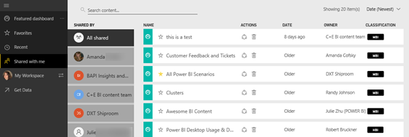

<properties
   pageTitle="Display the Power BI content that has been shared with me"
   description="documentation for shared with me in Power BI"
   services="powerbi"
   documentationCenter=""
   authors="mihart"
   manager="mblythe"
   backup=""
   editor=""
   tags=""
   qualityFocus="no"
   qualityDate=""/>

<tags
   ms.service="powerbi"
   ms.devlang="NA"
   ms.topic="article"
   ms.tgt_pltfrm="NA"
   ms.workload="powerbi"
   ms.date="11/10/2016"
   ms.author="mihart"/>

# Display the Power BI content that has been shared with me
## Shared with me
If a colleague shares a dashboard with you, it will [appear in **Shared with me**](powerbi-service-new-shared-with-me.md). The actions available to you on the **Shared with me** page is similar to a [workspace **Dashboards** tab](powerbi-service-workspaces.md). 

From here you can interact with the shared dashboards.

-  Hover over and select a dashboard to open it.

-  [Favorite a dashboard](powerbi-service-new-favorite-dashboards.md).

-  [Remove a dashboard](powerbi-service-delete.md)  

-   Some dashboards can be re-shared  

-  Certain types of dashboards can be copied 

    Additionally, if your lists of dashboards gets long, [use the search field and sorting to find what you need](powerbi-service-search-filter-sort.md).

    >[AZURE.NOTE] For information about EGRC classifications, select the classification button or [visit Dashboard data classification ](powerbi-service-data-classification.md).

##  Filter shared dashboards by owner

The content here can be further filtered by content owner (**Shared by**). For example, if I select **Amanda**, I see only the dashboard that Amanda has shared with me.

##  See also

[Power BI - Basic Concepts](powerbi-service-basic-concepts.md)

More questions? [Try the Power BI Community](http://community.powerbi.com/)
