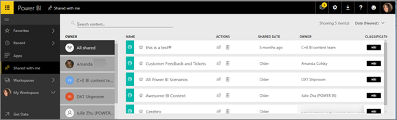

<properties
   pageTitle="Display the Power BI content that has been shared with me"
   description="documentation for shared with me in Power BI"
   services="powerbi"
   documentationCenter=""
   authors="mihart"
   manager="erikre"
   backup=""
   editor=""
   tags=""
   qualityFocus="no"
   qualityDate=""/>

<tags
   ms.service="powerbi"
   ms.devlang="NA"
   ms.topic="article"
   ms.tgt_pltfrm="NA"
   ms.workload="powerbi"
   ms.date="04/29/2017"
   ms.author="mihart"/>

# Display the Power BI dashboards that have been shared with me
## Shared with me

When a colleague shares a dashboard with you, its title is added to your **Shared with me** list. The dashboard is only available from **Shared with me** and not available from a workspace or from **Apps**.

You'll have many options for interacting with the dashboard and underlying report, depending on the permissions the owner gives you. These include being able to make copies of the dashboard, open the report [in Reading view](powerbi-service-interact-with-a-report-in-reading-view), and re-share with other colleagues.

##  Actions available from the **Shared with me** screen

-  Select the star icon to [Favorite a dashboard](powerbi-service-new-favorite-dashboards.md).

-  [Remove a dashboard](powerbi-service-delete.md)  

-   Some dashboards can be re-shared  

-  Certain types of dashboards can be copied 

- Additionally, if your lists of dashboards gets long, [use the search field and sorting to find what you need](powerbi-service-search-filter-sort.md).

    >[AZURE.NOTE] For information about EGRC classifications, select the classification button or [visit Dashboard data classification ](powerbi-service-data-classification.md).

-  Select the name of a dashboard to open it and explore. Once you've opened the shared dashboard you can use Q&A to ask questions about the underlying data or select a tile to open and interact with the report in Reading view.

##  Filter shared dashboards by owner

The content in the **Shared with me** screen can be further filtered by content owner. For example, if I select **Amanda**, I see only the dashboard that Amanda has shared with me.

##  See also

[Power BI - Basic Concepts](powerbi-service-basic-concepts.md)

More questions? [Try the Power BI Community](http://community.powerbi.com/)
