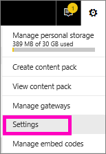

<properties
   pageTitle="Subscribe to a Power BI report"
   description="Learn how to subscribe yourself and others to a snapshot of a Power BI report"
   services="powerbi"
   documentationCenter=""
   authors="mihart"
   manager="mblythe"
   backup=""
   editor=""
   tags=""
   qualityFocus="monitoring"
   qualityDate=""/>

<tags
   ms.service="powerbi"
   ms.devlang="NA"
   ms.topic="article"
   ms.tgt_pltfrm="NA"
   ms.workload="powerbi"
   ms.date="01/03/2017"
   ms.author="mihart"/>
# Subscribe to a Power BI report
It's never been easier to stay up-to-date on your most important reports. Subscribe to report pages that matter most to you, and Power BI will email a snapshot of that page to your inbox. You tell Power BI how often you want to receive the emails: from once a day, to once a week, or never.

##  Requirements
**Creating** a subscriptions is a Power BI Pro feature.

##  Subscribe to a report page

1.  Open the report in [Reading view](powerbi-service-open-a-report-in-reading-view.md).

2.  From the top menubar, select **Subscribe**.

    

3.  You can subscribe to one report page at a time. Select the particular report page from the dropdown.

    

    Continue to add report pages.

4.  Use the yellow slider to turn the subscription for each page on and off.  Setting the slider to Off will not delete the subscription. To delete the subscription, select the trashcan icon.

    

5.  Select **Save and close** to save the subscription. You will receive an email snapshot of each report page when the report is refreshed. If the report doesn't refresh, you will not receive a snapshot email that day.  If the report refreshes more than once a day, you will only receive the email snapshot after the first refresh.

    

>[AZURE.TIP]Want to see the email right away? Trigger an email by opening your dataset and selecting **Refresh now**. If you don’t have edit permissions to the dataset, you will have to ask someone who has those permissions to do this for you.
>  

##  How the email schedule is determined
The following table describes how frequently you will receive an email. It all depends on the location of the dataset upon which the report is based (DirectQuery, Live connection, imported to Power BI, or Excel file in OneDrive or SharePoint Online) and on the subscription options available and selected (daily, weekly, or none).

|     |**DirectQuery**|**Live Connect**|**Scheduled refresh (import)**| **Excel file in OneDrive/SharePoint Online**|
|-------------|----------|----------|----------|----------|
|**How often does the report get refreshed?**|Every 15m|Power BI checks every 15 minutes, and if the dataset has changed, the report is refreshed.| User selects none, daily, or weekly. Daily can be up to 8 times a day. Weekly is actually a weekly schedule that the user creates and sets refresh for as few as once a week and as often as daily.| Once every hour|
|**How much control does the user have over the subscription email schedule?**|Options are: daily or weekly|No options: users is sent an email if the report refreshes, but no more than once per day.|No options: user is sent an email if the report refreshes (even if no changes are detected in the report), but no more than once per day.|No options: user is sent an email whenever the dataset is updated, but no more than once per day.|

##  Manage your subscriptions
There are 2 paths to the screen for managing your subscriptions.  The first is by selecting **Manage all subscriptions** from the **Subscribe to emails** dialog (see step 3 above). The second is by selecting the Power BI cog icon  from the top menubar and choosing **Settings**.

The particular subscriptions displayed will depend on which workspace is currently active.  To see all of your subscriptions at once for all workspaces, be sure that **My Workspace** is active. For help understanding workspaces, see [Workspaces in Power BI](powerbi-service-workspaces.md).

##  Limitations

-    At the current time, subscribe is not available for reports that come from content packs. But there is a workaround...make a copy of the report and add subscriptions to that report instead.

-    For email subscriptions on live connection datasets, you will only get emails when the data changes. So, if a refresh occurs but no data changes, Power BI will not send you an email.

-  Email subscriptions do not support custom visuals - they will be blank in the subscription email.

-  Email subscriptions are sent with the report's default filter and slicer states. Any changes to the defaults that you make before subscribing will not show up in the email.

More questions? [Try the Power BI Community](http://community.powerbi.com/)
