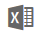

<properties
   pageTitle="Take a tour of Power BI service"
   description="tour navigate pbis"
   services="powerbi"
   documentationCenter=""
   authors="mihart"
   manager="mblythe"
   backup=""
   editor=""
   tags=""
   qualityFocus="no"
   qualityDate=""/>

<tags
   ms.service="powerbi"
   ms.devlang="NA"
   ms.topic="article"
   ms.tgt_pltfrm="NA"
   ms.workload="powerbi"
   ms.date="05/03/2017"
   ms.author="mihart"/>

# Take a tour of Power BI service (app.powerbi.com)
<!-- Shared newnav Include -->
[AZURE.INCLUDE [newnavbydefault](../includes/newnavbydefault.md)]

## View reports in the navigation pane

You can have more than one report-- as you add reports, their titles are added to your current Power BI workspace. Only one report can be open at a time.

Hover over and select a report to open it in the report editor.

From here you can do many things with your reports.

1. Hover over and select a report to open it

2. [Open the report in Excel](powerbi-service-new-analyze-in-excel.md) 

3. [Get insights](powerbi-service-new-insights.md) 

4. Review and edit report settings (including renaming)  

5. [Delete a report](powerbi-service-new-delete-a-report.md)  

6. Search the list of reports 

7. Sort the list of reports 

## For more information about reports

From the table of contents (on the left side of this browser page), expand **Reports** to see all the topics related to Power BI reports.

### Tips and troubleshooting

- Don't forget that [creating a report](powerbi-service-create-a-new-report.md)  requires a [dataset](powerbi-service-get-data.md).  

- Make sure you understand the difference between [Reading View](powerbi-service-interact-with-a-report-in-reading-view.md) and [Editing View](powerbi-service-interact-with-a-report-in-editing-view.md). 

- Familiarize yourself with the report editor by [Taking a tour](powerbi-service-the-report-editor-take-a-tour.md).

- Modify how your reports display using [page display settings](powerbi-service-change-report-display-settings.md).

- Do you know the difference between filter, highlight, cross-filter, and cross-highlight? If not, see [Filter and highlight data in reports](powerbi-service-about-filters-and-highlighting-in-reports.md).

- [Focus mode](powerbi-service-move-and-resize-a-visualization.md) and [full screen TV mode](powerbi-service-dash-and-reports-fullscreen.md) -- there is a difference.

