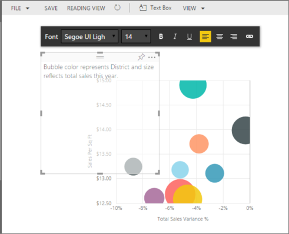
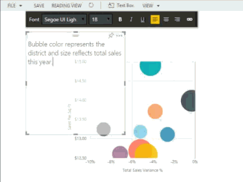

<properties
   pageTitle="Text Boxes in Power BI reports"
   description="Text Boxes in Power BI reports"
   services="powerbi"
   documentationCenter=""
   authors="mihart"
   manager="mblythe"
   editor=""
   tags=""/>

<tags
   ms.service="powerbi"
   ms.devlang="NA"
   ms.topic="article"
   ms.tgt_pltfrm="NA"
   ms.workload="powerbi"
   ms.date="10/14/2015"
   ms.author="mihart"/>
# Text Boxes in Power BI reports

In Editing View, add a text box to a report and then pin it to a dashboard. 

1.  Place your cursor anywhere on the report canvas and select **Text Box**.

    

2.  Type your text into the text box and, optionally, format font, color, and text alignment. 

    

3.  To position the Text Box, select the grey area at the top and drag. And to resize the Text Box, select and drag any of the outline handles. 

    

4.  To close the Text Box, select any blank space on the report canvas.

5.  Select the pin icon   to pin the Text Box to a dashboard. 

## See Also:

[Add a hyperlink to a Text Box](powerbi-service-add-a-hyperlink-to-a-text-box.md)

[Reports in Power BI](powerbi-service-reports.md)

[Visualizations in Power BI reports](powerbi-service-visualizations-for-reports.md)

[Power BI - Basic Concepts](powerbi-service-basic-concepts.md)
