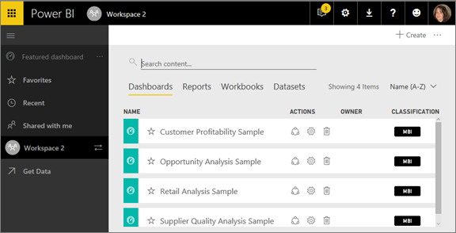

<properties
   pageTitle="The new Power BI navigation experience"
   description="Overview of the new Power BI navigation experience"
   services="powerbi"
   documentationCenter=""
   authors="mihart"
   manager="mblythe"
   backup=""
   editor=""
   tags=""
   qualityFocus="no"
   qualityDate=""/>

<tags
   ms.service="powerbi"
   ms.devlang="NA"
   ms.topic="article"
   ms.tgt_pltfrm="NA"
   ms.workload="powerbi"
   ms.date="12/11/2016"
   ms.author="mihart"/>

# The new Power BI navigation experience

####    November 2016

We are excited to announce a better way for you to navigate Power BI, quickly get to the dashboards that you access most often, and easily browse through all of your content. During this Preview phase, you'll be able to try it out and [switch back and forth between the old and new navigation experiences](powerbi-service-preview-features.md).

>[AZURE.TIP] Have questions or feedback? [Visit the Power BI community forum](http://community.powerbi.com/t5/Navigation-Preview-Forum/bd-p/NavigationPreview).

We've redesigned the navigation experience to make it easier for you to find and navigate your Power BI content.

-  streamlined the lists for dashboards, reports, workbooks, and datasets

-  added a separate content area for workbooks

-  created a separate area for your favorite dashboards

-  created a separate area for content that has been shared with you

-  created a separate area for your most-recent content

-   reduced the number of clicks required to accomplish tasks -- combined the lists of content, and the actions you can take on that content, on the same screen

##  Favorite dashboards

We heard from many users that you want to quickly access a few select dashboards that are most important to you. To help you reach the dashboards you go to most, we added a way to favorite those dashboards and make them easily accessible from all your workspaces.

1.  With the dashboard open, select **Favorite** from the top-right corner.

    

    **Favorite** changes to **Unfavorite** and the star icon becomes yellow.

    

2. To see all the dashboards that you have added as favorites, in the left navpane, select **Favorites** or select the Favorites icon .

    

    From here you can select a dashboard to open it, or share a dashboard with colleagues.

3.  Another way to mark a dashboard as a favorite is from the **Dashboards** tab.  Just open the workspace that contains the dashboard, and select the star icon to the left of the dashboard name.

    

##  Content View

We've also improved the way you navigate and access all your Power BI content. Before this, all of your dashboards, reports, and datasets were listed on the left navigation pane. Now, all that content doesn't appear in the navigation pane and instead displays within the context of a workspace. Select a workspace from the left navigation pane and the tabs for the associated content (dashboards, reports, workbooks, datasets) fill the Power BI canvas to the right.

## Working with groups and workspaces

We have also made improvements to way that content appears in your 'My workspace' or Group Workspaces. The content shows up on the main canvas area, with separate tabs for dashboards, reports, workbooks and datasets. Authors also get quick access to the top actions they might want to perform – for example, on the Reports tab, you can now run [Insights](powerbi-service-auto-insights.md) with one click and see the owner for each report.

You can switch workspaces by selecting the arrow next to the current workspace name.

##  Search, filter and sort content
The new content view makes it easier to search, filter and sort your content. To search for a dashboard, report or workbook, type in the search area. Power BI filters to only the content that has your search string as part of the name.

You can also filter to display only content that you own.  Power BI also lets you filter the content view to display alphabetically.

##  Switching between the 2 experiences
You can go back to the old experience any time by selecting the gear icon, and choosing **Settings>Preview Features**. You can also turn it back on anytime later, by visiting the same screen.
To learn how, see [Switch between the new and old Power BI navigation experiences](powerbi-service-preview-features.md).

Have questions or feedback? [Visit the Power BI community forum](http://community.powerbi.com/t5/Navigation-Preview-Forum/bd-p/NavigationPreview)
