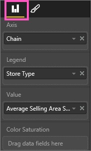
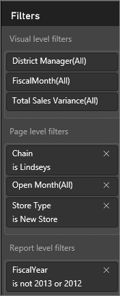
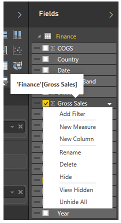
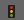

<properties
   pageTitle="The report editor...Take a tour"
   description="The report editor...Take a tour."
   services="powerbi"
   documentationCenter=""
   authors="mihart"
   manager="mblythe"
   backup=""
   editor=""
   tags=""
   qualityFocus="no"
   qualityDate=""/>

<tags
   ms.service="powerbi"
   ms.devlang="NA"
   ms.topic="article"
   ms.tgt_pltfrm="NA"
   ms.workload="powerbi"
   ms.date="06/21/2016"
   ms.author="mihart"/>
# The report editor...Take a tour

The Power BI report editor is made up of 3 panes:  **Fields**, **Visualizations**, and **Filters**, plus the top navigation bar and the report canvas.  

## The report editor panes

The panes on the left side, Visualizations and Filters, control what your visualizations look like -- type, colors, filtering.  And the pane on the right side, Fields, control the underlying data being used in the visualizations. 

The content displayed in the report editor varies by selections you make in the report canvas.  For example, when you select an individual visual, 

-   the top of the Visualization pane identifies the type of visual in use, 
-   the bottom of the Visualization pane displays the fields being used in the visual,
-   the Filters pane displays any filters that have been applied, and
-   the Fields list identifies tables (and fields if the table is already expanded) in use.

## The Visualizations pane (from top to bottom)

Select visual type, build your visual by adding and managing fields, and customize the look and feel of your visual.

### Change between different visual types by selecting the icon.

### Control the fields used in your visual.

The buckets shown in this pane vary depending on what type of visualization you have selected.  For example, if you've selected a bar chart, you'll see buckets for: Values, Axis, and Legend. When you select a field, or drag it onto the canvas, Power BI adds that field to one of the buckets.  You can also drag fields from the Fields list directly into the Visualizations buckets.  Some buckets are limited to certain types of data.  For example, **Values** won't accept non-numeric fields. So if you drag an **employeename** field into the **Values** bucket, Power BI changes it to **count of employeename**.

### Remove a field

To remove a field from the visualization, select the field and click the **X**.

For more information, see [Add visualizations to a Power BI report](powerbi-service-add-visualizations-to-a-report-i.md)

### Format your visuals

Select the paintbrush icon to display customization options. 

-   [Customizing  visualization title, background and legend](powerbi-service-tutorial-customize-visualization-title-background-and-legend.md)
-   [Color formatting](powerbi-service-getting-started-with-color-formatting-and-axis-properties.md)
-   [Customizing X-axis and Y-axis properties](powerbi-service-tutorial-customize-x-axis-and-y-axis-properties.md)

    

## The Filters pane

View, set, and modify page, report, and visual-level filters.

For more information, see [Add a filter to a report](powerbi-service-add-a-filter-to-a-report.md).

## The Fields pane 

The Fields pane displays the tables and fields that exist in your data.  Use these fields to create visualizations.

-   Drag a field onto the page to start a new visualization.  You can also drag a field onto an existing visualization to add the field.

-   Or, select the checkbox next to a field.  If a visualization is selected on the canvas, then the new field is added to that visualization.

-   Either way, each selected field is added to the Visualizations pane in the report editor.

**NOTE**: If you're using Power BI Desktop, you can reach options to show/hide fields, add calculations etc, from here as well:

### What do the field icons mean?

-
**∑ Aggregates**
  An aggregate is a numeric value that will be summed or averaged, for example. Aggregates are imported with the data (defined in the data model your report is based on).

  For more information, see [Aggregates in Power BI reports](powerbi-service-aggregates.md).

-  ** Calculated fields**  
	Each calculated field has its own hard-coded formula. You can’t change the calculation, for example, if it’s a sum, it can only be a sum. 

-  **Unique fields**  
	Fields with this icon were imported from Excel and are set to show all values, even if they have duplicates. For example your data might have two records for people named 'John Smith', and each will be treated as unique -- they won't be summed.  

-  ** Geography fields**  
	Location fields can be used to create map visualizations. 

-  ** Hierarchy**  
    Select the arrow to reveal the fields that make up the hierarchy. 

## The top navigation bar
The actions available from the top navigation bar are numerous; with new actions being added all the time. For information about a particular action, use the Power BI Documentation Table of Contents or Search box.

## Next Steps:

[Edit a report](powerbi-service-interact-with-a-report-in-editing-view.md)

[Create a report](powerbi-service-create-a-new-report.md)

## See also

Read more about [reports in Power BI](powerbi-service-reports.md)

[Get started with Power BI](powerbi-service-get-started.md)

[Power BI - Basic Concepts](powerbi-service-basic-concepts.md)
